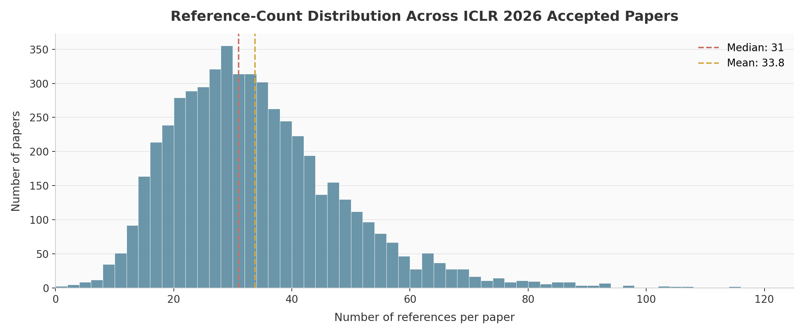
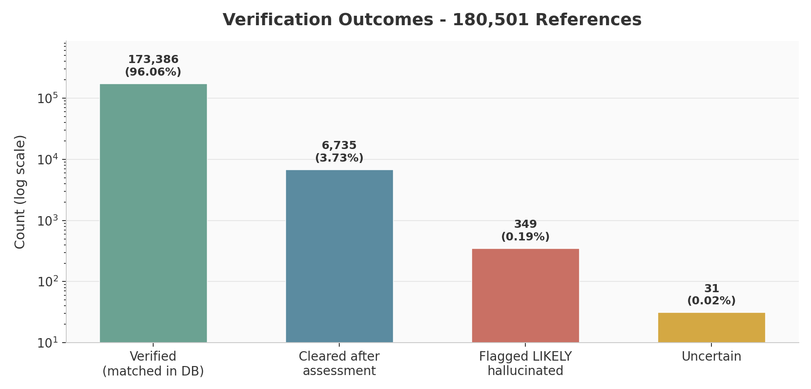
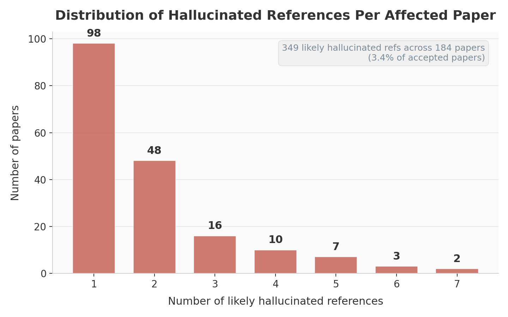
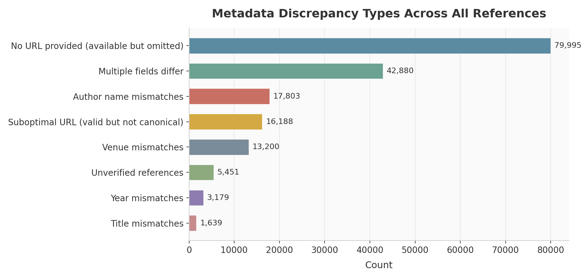

# How Clean Are the References in ICLR 2026?
## A Full Scan of 180,501 Citations

*Mark Russinovich and Ram Shankar Siva Kumar*

#### April 22, 2026
With LLM-assisted writing becoming mainstream in research, a natural question is whether hallucinated references are slipping into top-venue papers. To get the full picture, we ran RefChecker against every accepted paper at ICLR 2026 and found that **about 1 in 29 accepted papers contain at least one likely hallucinated   reference.** Out of 5,348 processed papers with 180,501 total citations, RefChecker flagged **349 likely hallucinations** across **184 papers** (3.4%).

Prior work by Esau et. al used [GPTZero] (https://gptzero.me/news/iclr-2026/) to find that 50+ hallucinatinos in papers that were under review. ICLR posted a retrospective on their [review process] (https://blog.iclr.cc/2026/03/31/a-retrospective-on-the-iclr-2026-review-process/) outlining at high level, their process for detecting hallucinated references in submitted papers using automated and human review, and how if found, they were desk rejected with an appeals process. 

But the analysis was on submitted papers. What about accepted, camera-ready papers? Were they all free of hallucinated references? Our analysis says no. In early April 2026, we ran RefChecker (https://github.com/markrussinovich/refchecker), an open-source reference-verification tool, against every accepted paper at ICLR 2026. That came out to 5,348 papers and 180,501 citations. About 1 in 29 camera ready contain at least one reference that looks fabricated. We then focused on the 12 papers with five or more flagged references. We notified the ICLR Program Committee on April 13, 2026, and emailed each of those 12 author teams, of which 10 wrote back.

This writeup covers what we found, what the authors told us about how the hallucinations got there, how ICLR's Program Chairs responded, and what we think the rest of the community should do about it. We have anonymized individual papers, authors, and institutions, but have offered to ICLR the full list of 184 papers with hallucinated references.  

## Key Takeaways

1. **  1 in 29 camera ready papers at ICLR contained hallucinated references, which questions the archival record.** 184 of the 5,348 accepted ICLR 2026 papers contain at least one likely fabricated reference. 12 of them contain five or more. It is important to note that all of these papers went through ICLR’s automated system checks and passed three rounds of human review. This is not a dig at ICLR’s system or the volunteers’ efforts but rather that detecting hallucinated reference is a tricky problem and that there is no silver bullet solution.   

2. **The most common cause is a workflow failure,.** When we asked authors how the hallucinated references got into their papers, the answer was usually some version of these events:the author found the right paper, they read it, and decided to cite it. They then they asked an LLM or an AI-assisted browser to turn the title or URL into a formatted citation, and the formatting step got the authors wrong, or the venue wrong, or truncated the title. The output went into the paper and which no one checked it. In our opinion, these are good faith authors who tried to use LLMs to speed up the drudgery and is a different problem from the "AI slop" framing that has dominated the coverage of LLMs in academia so far.

3. **We count two kinds of hallucinations.** The first is the paper being cited does not exist. The second is: the paper exists and the title is substantially right, but the citation gets the authors substantially wrong. Note that we did not count references that exist, but where the authors and title have relatively minor issues, nor ones where the cited URL points at a different paper, both of which are extremely common. 

4. **ICLR is applying its own policy unevenly because of resource constraints.** 
Firstly, we want to make sure that this work is not interpreted as harsh criticism of ICLR. They are a volunteer run, non profit who are doing their best to further the scientific inquiry of this rapid moving field. 
When we reached out about this issue to the Program Chairs, they told us that they do not have the resources to run the same human-review process on the accepted corpus, which is a fair constraint. We point out that as a consequence, ICLR’s Code of Ethics is therefore applied unevenly depending on if the paper was submitted or was accepted. 
Note: We are not calling for ICLR to revisit the acceptance of these papers, but to ask these affected papers to correct the archival record. 
.  

5. **This problem is going to show up at every conference until the community agrees on norms.** ICLR is not a special case, and we posit that every venue that accepts a lot of submissions is going to see the same patterns. Our goal is not to outlaw LLMs in academic arenas but to get the community to agree on norms to verify AI-assisted bibliographies, and what conferences owe authors when hallucinations get caught after acceptance.
## RefChecker

[RefChecker](https://github.com/markrussinovich/refchecker) is an open-source tool for validating academic references. It extracts each bibliography entry from a PDF, parses the structured fields, and then checks the reference against multiple academic data sources.

The verification pipeline works in layers. First, RefChecker tries to match each citation against Semantic Scholar, OpenAlex, and CrossRef using normalized title similarity and author-overlap checks. For references that still do not resolve cleanly, RefChecker applies deterministic filters and then sends the flagged subset to an LLM with web search access for a final hallucination assessment.

For this scan, we used a local Semantic Scholar snapshot (233 million papers, 87 GB) as the primary database, with API fallbacks to CrossRef, DBLP, OpenAlex, and OpenReview. The LLM for both extraction and hallucination assessment was Claude Sonnet 4.6.

## Results

RefChecker downloaded and extracted bibliographies from all 5,355 accepted ICLR 2026 papers on OpenReview. Seven could not be processed, leaving 5,348 papers with a combined 180,501 references. The typical paper cites about 33.8 references (median: 31), though some survey-style papers go well above 100 and a few short papers cite only one or two.

*Distribution of references per paper across the ICLR 2026 corpus.*

| Outcome | Count | Percent |
|---|---:|---:|
| Verified (matched in database) | 173,386 | 96.06% |
| Cleared after assessment | 6,735 | 3.73% |
| Uncertain (insufficient signal) | 31 | 0.02% |
| **Flagged LIKELY hallucinated** | 349 | 0.19% |

*Verification outcomes for all 180,501 extracted references.*

Using a conservative definition of likely hallucination, RefChecker flagged **349 references as LIKELY hallucinated** across **184 papers** - 3.4% of accepted papers. Most affected papers have one or two likely hallucinations; **38 papers have 3 or more**, and **12 papers have 5 or more**.

*Distribution of likely hallucinated references per affected paper.*

## Author Response

Before publishing, we wanted to give both the ICLR Program Committee and the authors of affected papers an opportunity to review the findings, respond, and correct the archival record. Our goal was to avoid surprising anyone and to treat the scan as the start of a conversation rather than a conclusion. 

Our scan flagged hundreds of papers containing at least one likely fabricated reference. Reaching out individually to every author team at that scale was not tractable in the time available, so we focused on the 12 papers with five or more flagged references. We emailed each of those author teams directly, attached the full report so they could examine our methodology and the specific assessments for their paper, and asked for a response by the planned blog publication date, roughly a five-day window. 
Ten of the 12 author teams responded. Every author team that responded with accepting fault — without exception — moved to correct the archival record. Corrections took the form of updated arXiv preprints, emergency camera-ready update requests submitted to ICLR, public comments acknowledging the issues on OpenReview, and in one case a decision to withdraw the paper entirely rather than allow an uncorrected version to remain in circulation. 

The discussion in section below draws on a set of exemplar responses that illustrate the distinct categories of causes authors described. It is not an exhaustive summary of every reply we received.

The tenor of the responses was, in our view, the most encouraging part of this exercise. Authors who engaged did so seriously. They examined the flagged references one by one and they acknowledged errors directly when errors existed, disputed specific findings when they believed the tool was wrong, and in most cases volunteered fixes before we asked. Several explicitly thanked us for the chance to respond before publication.  

Two author teams asked whether their paper might be excluded from a public writeup, citing concerns about lab reputation and the disproportionate effect naming might have relative to the underlying errors. After reflecting on the responses we received, we decided that the blog post would not name individual papers, institutions, or authors. The aggregate findings and the methodological observations are the contribution worth making. 
Note: We have offered ICLR the list of 184 papers with hallucinated references 

## ICLR's Response 

We first notified the ICLR 2026 Program Committee on April 13, 2026. In that note, we shared a summary of the findings, described the RefChecker methodology, and invited comparison against ICLR's own review-time process. The Program Chairs responded thoughtfully and engaged with the findings across several exchanges. We discuss their substantive response in Section 4. 

ICLR's Program Chairs engaged constructively from our first email. In their initial response, one of the Program Chairs described the review-time process in detail: an automated system flagged a large number of submissions (around 934), area chairs performed a first round of human review, Program Chairs reviewed the flagged references themselves, and ultimately papers with confirmed hallucinated references were desk-rejected. The automated system had a significant false positive rate, which is why multiple rounds of human review were considered necessary before any enforcement action. This process contributed to ICLR 2026's unusually high desk rejection rate. 

When we asked whether ICLR would be issuing a statement for the blog post, the response was that a coordinated statement would require coordination across all Program Chairs, the General Chair, the board, and others, and was not feasible on the timeline. The Chairs also noted that ICLR operates on a model of openness and that external analyses of the published record are expected and welcomed. 

When we asked what the policy called for in cases where hallucinations were confirmed in already-accepted papers, the answer pointed back to operational reality. As a non-profit volunteer-run organization, ICLR does not have the resources to re-run hallucination checks on the camera-ready versions of accepted papers. The review-time process required substantial human-review effort that cannot realistically be replicated on the accepted corpus. 

## Hallucination Analysis

Before discussing causes, it is worth being explicit about what we counted as a hallucinated reference. The responses surfaced two distinct categories, and we treat both as hallucinations in this writeup. 

The first is fabrication: the cited paper does not exist. No real publication corresponds to the title as cited, and web and database searches surface no such work. This is the failure mode most people picture when they hear "LLM-hallucinated citation." 

The second is metadata corruption: the cited paper exists and the title is (roughly) correct, but the authors are substantially wrong. A reader who searches for the title can sometimes find the right paper, but the citation as written misattributes credit and misdirects verification. Several author responses pushed back on calling this category a hallucination, arguing that the titles were real and only auxiliary fields were wrong. We disagree, respectfully.  As mentioned earlier, we took a conservative approach and did not flag references that have incorrect arXiv IDs, DOIs, or URLs pointing at completely different papers. 

### Cause 1: Using LLMs or AI browsers to convert references into BibTeX 

This was the single most common cause described, appearing across multiple independent responses. In this pattern, the author had found real papers through normal scholarly search. They had read the papers, decided which ones to cite, and located the correct URL or title for each. At that point, they used an LLM or an AI-assisted browser tool to convert the title or URL into a formatted BibTeX entry. The conversion step introduced errors including truncated or altered titles, wrong author lists, substituted venues that the authors did not catch before submission. 

One author team described using "Perplexity's Comet browser to convert a paper URL or title to a bibtex entry." Another described using an LLM to "convert an existing reference list into BibTeX format." A third described prompting an LLM with existing paper titles to "organize a bibtex file." In each case, the intended source paper was real and correctly identified by the author, but the formatted citation that ended up in the manuscript misrepresented the authors, venue, or title. 

### Cause 2: References inserted by collaborators without vetting 

Several responses described references added by external collaborators, in one case during time away from lab, in another "amidst a series of edits during off hours" before a deadline  that the primary authors did not independently verify before submission. The underlying error was still a hallucination; the proximate cause was a collaboration workflow in which no one team member owned bibliographic integrity across the final manuscript. 

### Cause 3: Careless citation errors 

Some responses acknowledged errors that had nothing to do with LLMs: wrong titles pasted in, authors remembered incorrectly, venues misattributed. These are the kinds of errors that have always existed in academic bibliographies. 

### Cause 4: Citing forthcoming or unindexed work without a public preprint 

One author team attributed several flagged references to work recently accepted at upcoming venues but not yet published. When asked whether preprints were available anywhere that a reader could locate — arXiv, group pages, institutional repositories — the answer was "preprints are not available currently." The works may well exist and be real, but as citations in the published ICLR paper they are not verifiable by any reader today. 

### Cause 5: Webpage-style references to living URLs and model cards 

Some flags pointed to citations of vendor documentation, model release pages, or system cards for commercial models without corresponding academic papers. In several cases, the content on those URLs changed between the author's access date and the scan date, producing a mismatch the tool read as a hallucinated citation. In other cases, the cited "title" was a descriptive label the author had assigned rather than the published title of an existing document. Authors described these as false alerts, and we think that framing is fair for some of them. But the broader pattern — citing living URLs as if they were stable academic references — is itself a citation-hygiene problem that will only grow as more of the field cites commercial model releases.

## Metadata Quality

Hallucinated references draw the most attention, but the much larger practical problem is metadata quality. Across the corpus, tens of thousands of references have mismatched URLs, author strings, venues, years, or multiple fields at once.

| Issue | Count | Per Paper (avg) |
|---|---:|---:|
| No URL provided (available but omitted) | 79,995 | 15.0 |
| Multiple fields differ | 42,880 | 8.0 |
| Author name mismatches | 17,803 | 3.3 |
| Suboptimal URL (valid but not canonical) | 16,188 | 3.0 |
| Venue mismatches | 13,200 | 2.5 |
| Unverified references | 5,451 | 1.0 |
| Year mismatches | 3,179 | 0.6 |
| Title mismatches | 1,639 | 0.3 |

*Distribution of metadata discrepancy types across all references.*

URL issues alone affect 96,183 references, or more than half the corpus. Of those, 79,995 omit an available URL entirely and 16,188 point to a valid but non-canonical landing page. That works out to roughly 18.0 URL-related issues per paper on average.

## Reflections

### Reflection 1: Authors bear final responsibility, whatever tools they use 

Using LLMs in manuscript preparation is permissible under ICLR's policy, and several author responses specifically disclosed LLM use in line with that policy. The responses also made clear that disclosure does not reduce the author's responsibility for the final artifact. The most striking corrective actions came from teams that took this seriously — treating the hallucinated references as their own failure of verification rather than a failure of the tool they used. That framing is the right one. Whatever an LLM, an AI browser, or a bibliography-conversion tool produces, the author is the one who submits the paper. 

### Reflection 2: The community needs clearer norms around disclosing LLM usage 

ICLR's policy requires disclosure of LLM use, and most responses indicated the authors had disclosed. But "LLM was used in manuscript preparation" covers a wide range of activities: language polishing, drafting bibliographies, converting formats, writing related-work sections, generating figures, or all of the above. Each of those carries different integrity implications. A blanket disclosure is better than no disclosure, but the field would benefit from more granular norms, specifically which part of the lifecycle saw LLM use, and what verification the authors performed on the output. The specific failure mode described most often in these responses (LLMs used to convert references to BibTeX, with no independent check of the output) is a clear example of a workflow step where targeted disclosure and targeted verification would have prevented the problem. 

### Reflection 3: There is a tension between thoroughness and resourcing that we need to confront in academic peer review setting 

On the one hand, ICLR's published policy desk rejected papers with confirmed hallucinated references during the review process. In our scan of the accepted papers, about 1 in 29 contain at least one likely fabricated reference. The same Code of Ethics violation is producing different outcomes based only on when detection happens. As mentioned above, we are not asking ICLR to revisit acceptance decisions but we are pointing out that the policy, as applied, is uneven and that the community would benefit from ICLR being more transparent about the tooling and methodology it used during review. Beyond the high-level pipeline description in the retrospective, the specific design choices, thresholds, metrics, and execution details of ICLR's reference checks have not been shared publicly. Without that transparency, it is hard for other venues to learn from ICLR's experience, and hard for external scans like ours to calibrate findings against what the review process actually caught. We invite ICLR to share their methodology with the community.

On the other hand, we should recognize what these changes mean in practice. The Program Chairs told us directly that they do not have the resources to re-run hallucination checks on the camera-ready corpus. Running the same process again on the accepted papers would require it twice over.  It is important to recognize that researchers who take on conference service, do it on on top of their day jobs, and there is an upper limit to thoroughness. 

  It would be easy to call for ICLR to enforce its own policy consistently across review and post-acceptance, and much harder to say where the volunteer hours to do that work would come from. The field has quietly assumed for years that conference governance scales with submission volume, and it mostly has, because volunteers have absorbed the growth. That assumption is starting to break. 

What we are really asking here is not whether ICLR can do more with the resources it has, but whether the community is willing to invest in the infrastructure that policy enforcement at this scale actually requires. That is a conversation for the whole field, not for the people already doing the work.

## Acknowledgement
We would like to thank Ahmed Salem for helpful discussions on this topic. 

 

## Appendix: Scan Configuration and Runtime

We are continuing to optimize RefChecker's performance, and preliminary investigation of other LLMs and improved extraction precision show potential for a cost reduction of 10x or more with a runtime improvement of 2x or more. For this scan, the configuration was as follows:

| Detail | Value |
|---|---|
| Tool | [RefChecker](https://github.com/markrussinovich/refchecker) v3.0.77 |
| LLM (extraction + assessment) | Claude Sonnet 4.6 (with web search for assessment) |
| Primary database | Semantic Scholar local snapshot (233M papers, 87 GB) |
| Fallback APIs | CrossRef, DBLP, OpenAlex, OpenReview |
| Papers downloaded | 5,355 |
| Papers processed | 5,348 (7 failed - corrupt PDFs or missing bibliographies) |
| Total references extracted | 180,501 |
| LLM cost | ~$1,600 |
| Total wall-clock time | ~12 hours |
| Infrastructure | 3 machines x 10 workers |

