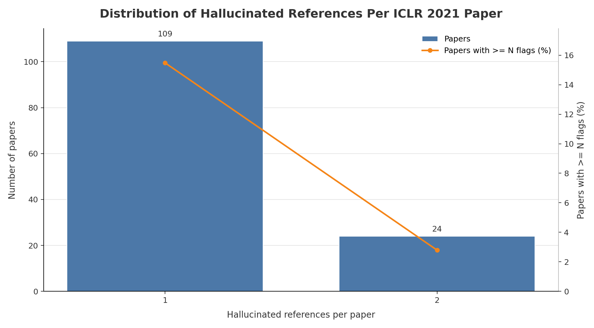

# ICLR 2021 Hallucinated Reference Report

Generated: 2026-05-19 01:35:32 UTC

Source: `_workspace/iclr2021/results/scan_report.json`

## Summary

| Metric | Count |
|---|---:|
| Hallucinated references | 157 |
| Papers with hallucinated references | 133 |
| Papers with >=3 hallucinated references | 0 |

## Distribution

| Hallucinated refs | Papers with exactly this count |
|---:|---:|
| 1 | 109 |
| 2 | 24 |

## Papers With >=3 Hallucinated References

| Rank | Hallucinated refs | Paper ID | Title | Total references | OpenReview |
|---:|---:|---|---|---:|---|
