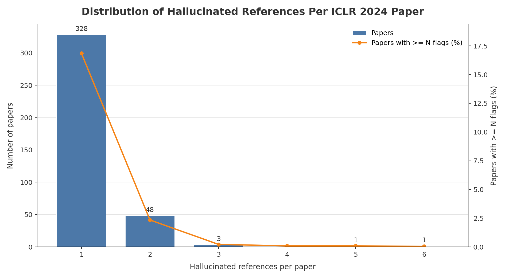

# ICLR 2024 Hallucinated Reference Report

Generated: 2026-05-19 01:35:36 UTC

Source: `_workspace/iclr2024/results/scan_report.json`

## Summary

| Metric | Count |
|---|---:|
| Hallucinated references | 444 |
| Papers with hallucinated references | 381 |
| Papers with >=3 hallucinated references | 5 |

## Distribution

| Hallucinated refs | Papers with exactly this count |
|---:|---:|
| 1 | 328 |
| 2 | 48 |
| 3 | 3 |
| 5 | 1 |
| 6 | 1 |

## Papers With >=3 Hallucinated References

| Rank | Hallucinated refs | Paper ID | Title | Total references | OpenReview |
|---:|---:|---|---|---:|---|
| 1 | 6 | `fq1wNrC2ai` | Sample-efficient Learning of Infinite-horizon Average-reward MDPs with General Function Approximation | 43 | [link](https://openreview.net/forum?id=fq1wNrC2ai) |
| 2 | 5 | `NYN1b8GRGS` | GIM: Learning Generalizable Image Matcher From Internet Videos | 36 | [link](https://openreview.net/forum?id=NYN1b8GRGS) |
| 3 | 3 | `FddFxi08J3` | On the Power of the Weisfeiler-Leman Test for Graph Motif Parameters | 40 | [link](https://openreview.net/forum?id=FddFxi08J3) |
| 4 | 3 | `JW3jTjaaAB` | AirPhyNet: Harnessing Physics-Guided Neural Networks for Air Quality Prediction | 21 | [link](https://openreview.net/forum?id=JW3jTjaaAB) |
| 5 | 3 | `KiespDPaRH` | Improving the Convergence of Dynamic NeRFs via Optimal Transport | 28 | [link](https://openreview.net/forum?id=KiespDPaRH) |
