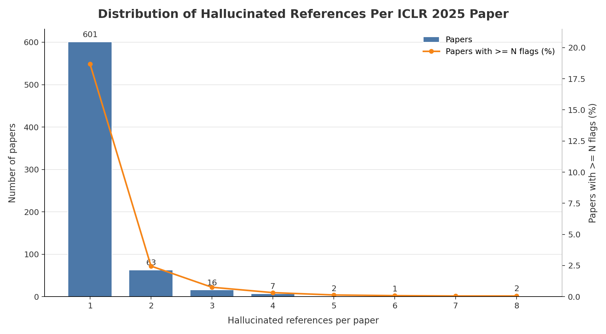

# ICLR 2025 Hallucinated Reference Report

Generated: 2026-05-20 13:28:31 UTC

Source: `_workspace/iclr2025/results/scan_report.json`

## Summary

| Metric | Count |
|---|---:|
| Hallucinated references | 835 |
| Papers with hallucinated references | 692 |
| Papers with >=3 hallucinated references | 28 |

## Distribution

| Hallucinated refs | Papers with exactly this count |
|---:|---:|
| 1 | 601 |
| 2 | 63 |
| 3 | 16 |
| 4 | 7 |
| 5 | 2 |
| 6 | 1 |
| 8 | 2 |

## Papers With >=3 Hallucinated References

| Rank | Hallucinated refs | Paper ID | Title | Total references | OpenReview |
|---:|---:|---|---|---:|---|
| 1 | 8 | `5btFIv2PNb` | LoR-VP: Low-Rank Visual Prompting for Efficient Vision Model Adaptation | 41 | [link](https://openreview.net/forum?id=5btFIv2PNb) |
| 2 | 8 | `YcUV5apdlq` | Multilevel Generative Samplers for Investigating Critical Phenomena | 88 | [link](https://openreview.net/forum?id=YcUV5apdlq) |
| 3 | 6 | `LvNROciCne` | AdaRankGrad: Adaptive Gradient Rank and Moments for Memory-Efficient LLMs Training and Fine-Tuning | 39 | [link](https://openreview.net/forum?id=LvNROciCne) |
| 4 | 5 | `GrDne4055L` | Adversarially Robust Out-of-Distribution Detection Using Lyapunov-Stabilized Embeddings | 90 | [link](https://openreview.net/forum?id=GrDne4055L) |
| 5 | 5 | `ZeaTvXw080` | Add-it: Training-Free Object Insertion in Images With Pretrained Diffusion Models | 25 | [link](https://openreview.net/forum?id=ZeaTvXw080) |
| 6 | 4 | `0mtz0pet1z` | Incremental Causal Effect for Time to Treatment Initialization | 28 | [link](https://openreview.net/forum?id=0mtz0pet1z) |
| 7 | 4 | `5ZEbpBYGwH` | COPER: Correlation-based Permutations for Multi-View Clustering | 41 | [link](https://openreview.net/forum?id=5ZEbpBYGwH) |
| 8 | 4 | `FEpAUnS7f7` | Empowering Users in Digital Privacy Management through Interactive LLM-Based Agents | 18 | [link](https://openreview.net/forum?id=FEpAUnS7f7) |
| 9 | 4 | `iX7eHHE5Tx` | REMEDY: Recipe Merging Dynamics in Large Vision-Language Models | 41 | [link](https://openreview.net/forum?id=iX7eHHE5Tx) |
| 10 | 4 | `jCDF7G3LpF` | EFFICIENT JAILBREAK ATTACK SEQUENCES ON LARGE LANGUAGE MODELS VIA MULTI-ARMED BANDIT-BASED CONTEXT SWITCHING | 29 | [link](https://openreview.net/forum?id=jCDF7G3LpF) |
| 11 | 4 | `lqTILjL6lP` | RESuM: A Rare Event Surrogate Model for Physics Detector Design | 33 | [link](https://openreview.net/forum?id=lqTILjL6lP) |
| 12 | 4 | `pCj2sLNoJq` | A Generalist Hanabi Agent | 39 | [link](https://openreview.net/forum?id=pCj2sLNoJq) |
| 13 | 3 | `1NevL7zdHS` | Revisiting Mode Connectivity in Neural Networks with Bezier Surface | 22 | [link](https://openreview.net/forum?id=1NevL7zdHS) |
| 14 | 3 | `5RUM1aIdok` | GraphEval: A Lightweight Graph-Based LLM Framework for Idea Evaluation | 30 | [link](https://openreview.net/forum?id=5RUM1aIdok) |
| 15 | 3 | `A23C57icJt` | Open-CK: A Large Multi-Physics Fields Coupling benchmarks in Combustion Kinetics | 36 | [link](https://openreview.net/forum?id=A23C57icJt) |
| 16 | 3 | `FiyS0ecSm0` | Proving Olympiad Inequalities by Synergizing LLMs and Symbolic Reasoning | 47 | [link](https://openreview.net/forum?id=FiyS0ecSm0) |
| 17 | 3 | `LGafQ1g2D2` | Can LLMs Understand Time Series Anomalies? | 20 | [link](https://openreview.net/forum?id=LGafQ1g2D2) |
| 18 | 3 | `OIvg3MqWX2` | A Theoretically-Principled Sparse, Connected, and Rigid Graph Representation of Molecules | 36 | [link](https://openreview.net/forum?id=OIvg3MqWX2) |
| 19 | 3 | `R4q3cY3kQf` | MaxInfoRL: Boosting exploration in reinforcement learning through information gain maximization | 60 | [link](https://openreview.net/forum?id=R4q3cY3kQf) |
| 20 | 3 | `SRghq20nGU` | Learning the Optimal Stopping for Early Classification within Finite Horizons via Sequential Probability Ratio Test | 43 | [link](https://openreview.net/forum?id=SRghq20nGU) |
| 21 | 3 | `Uo4EHT4ZZ8` | LeanAgent: Lifelong Learning for Formal Theorem Proving | 58 | [link](https://openreview.net/forum?id=Uo4EHT4ZZ8) |
| 22 | 3 | `VoayJihXra` | NeSyC: A Neuro-symbolic Continual Learner For Complex Embodied Tasks In Open Domains | 34 | [link](https://openreview.net/forum?id=VoayJihXra) |
| 23 | 3 | `WQQyJbr5Lh` | Discovering Influential Neuron Path in Vision Transformers | 44 | [link](https://openreview.net/forum?id=WQQyJbr5Lh) |
| 24 | 3 | `eENHKMTOfW` | Unveiling the Secret Recipe: A Guide For Supervised Fine-Tuning Small LLMs | 43 | [link](https://openreview.net/forum?id=eENHKMTOfW) |
| 25 | 3 | `hSZaCIznB2` | No Location Left Behind: Measuring and Improving the Fairness of Implicit Representations for Earth Data | 24 | [link](https://openreview.net/forum?id=hSZaCIznB2) |
| 26 | 3 | `pdjkikvCch` | Random-Set Neural Networks | 75 | [link](https://openreview.net/forum?id=pdjkikvCch) |
| 27 | 3 | `s7lzZpAW7T` | Dynamic-SUPERB Phase-2: A Collaboratively Expanding Benchmark for Measuring the Capabilities of Spoken Language Models with 180 Tasks | 83 | [link](https://openreview.net/forum?id=s7lzZpAW7T) |
| 28 | 3 | `sGqd1tF8P8` | Your Weak LLM is Secretly a Strong Teacher for Alignment | 60 | [link](https://openreview.net/forum?id=sGqd1tF8P8) |
