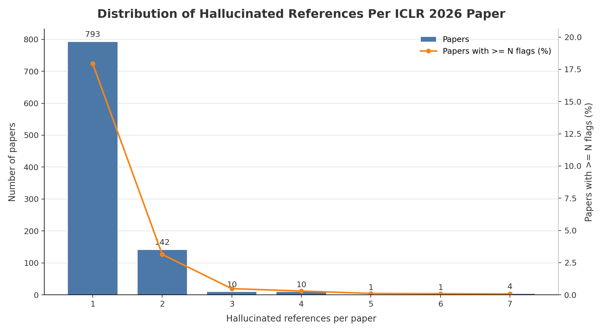

# ICLR 2026 Hallucinated Reference Report

Generated: 2026-05-20 02:47:18 UTC

Source: `_workspace/iclr2026/results/scan_report.json`

## Summary

| Metric | Count |
|---|---:|
| Hallucinated references | 1,186 |
| Papers with hallucinated references | 961 |
| Papers with >=3 hallucinated references | 26 |

## Distribution

| Hallucinated refs | Papers with exactly this count |
|---:|---:|
| 1 | 793 |
| 2 | 142 |
| 3 | 10 |
| 4 | 10 |
| 5 | 1 |
| 6 | 1 |
| 7 | 4 |

## Papers With >=3 Hallucinated References

| Rank | Hallucinated refs | Paper ID | Title | Total references | OpenReview |
|---:|---:|---|---|---:|---|
| 1 | 7 | `H8tismBT3Q` | AFD-INSTRUCTION: A Comprehensive Antibody Instruction Dataset with Functional Annotations for LLM-Based Understanding and Design | 33 | [link](https://openreview.net/forum?id=H8tismBT3Q) |
| 2 | 7 | `IRhYVOKFe0` | LogicReward: Incentivizing LLM Reasoning via Step-Wise Logical Supervision | 62 | [link](https://openreview.net/forum?id=IRhYVOKFe0) |
| 3 | 7 | `JFY9MZtWTu` | T-TAMER: Provably Taming Trade-offs in ML Serving | 63 | [link](https://openreview.net/forum?id=JFY9MZtWTu) |
| 4 | 7 | `nspzrcvzcB` | Entropy-Monitored Kernelized Token Distillation for Audio-Visual Compression | 78 | [link](https://openreview.net/forum?id=nspzrcvzcB) |
| 5 | 6 | `C5Ihi4bVQt` | LLMS ON TRIAL: Evaluating Judicial Fairness For Large Language Models | 47 | [link](https://openreview.net/forum?id=C5Ihi4bVQt) |
| 6 | 5 | `ofgxkMLqic` | Skywork-Reward-V2: Scaling Preference Data Curation via Human-AI Synergy | 41 | [link](https://openreview.net/forum?id=ofgxkMLqic) |
| 7 | 4 | `5Q8r8ZubAH` | Multiverse Mechanica: A Testbed for Learning Game Mechanics via Counterfactual Worlds | 34 | [link](https://openreview.net/forum?id=5Q8r8ZubAH) |
| 8 | 4 | `73J3hsato3` | Social Agents: Collective Intelligence Improves LLM Predictions | 20 | [link](https://openreview.net/forum?id=73J3hsato3) |
| 9 | 4 | `DuNf2vPTTK` | Taming Curvature: Architecture Warm-up for Stable Transformer Training | 29 | [link](https://openreview.net/forum?id=DuNf2vPTTK) |
| 10 | 4 | `GrsofC2FqF` | Detection of unknown unknowns in autonomous systems | 35 | [link](https://openreview.net/forum?id=GrsofC2FqF) |
| 11 | 4 | `MQmrcX5jnk` | Learning Boltzmann Generators via Constrained Mass Transport | 65 | [link](https://openreview.net/forum?id=MQmrcX5jnk) |
| 12 | 4 | `Tmrjxq4d7w` | Secure Outlier-Aware Large Language Model Inference | 32 | [link](https://openreview.net/forum?id=Tmrjxq4d7w) |
| 13 | 4 | `V35oo1SVGH` | VITA: Zero-Shot Value Functions via Test-Time Adaptation of Vision–Language Models | 42 | [link](https://openreview.net/forum?id=V35oo1SVGH) |
| 14 | 4 | `gE17TwVMNh` | Dynamic Reflections: Probing Video Representations with Text Alignment | 46 | [link](https://openreview.net/forum?id=gE17TwVMNh) |
| 15 | 4 | `i8vZvBFNJg` | MAGO: Beyond Fixed Hyperparameters with Multi-Objective Pareto Optimization for Hybrid LLM Reasoning | 51 | [link](https://openreview.net/forum?id=i8vZvBFNJg) |
| 16 | 4 | `zxlbh55PhC` | Clustering by Denoising: Latent plug-and-play diffusion for single-cell embeddings | 39 | [link](https://openreview.net/forum?id=zxlbh55PhC) |
| 17 | 3 | `9ZogcRkhoG` | Representing local protein environments with machine learning force fields | 36 | [link](https://openreview.net/forum?id=9ZogcRkhoG) |
| 18 | 3 | `C5OIolrNJd` | GeneBreaker: Jailbreak Attacks against DNA Language Models with Pathogenicity Guidance | 43 | [link](https://openreview.net/forum?id=C5OIolrNJd) |
| 19 | 3 | `FHTt9ipAra` | Mitigating Hallucination in Vision-Language Model with Depth and Spatial-aware Key-Value Refinement | 44 | [link](https://openreview.net/forum?id=FHTt9ipAra) |
| 20 | 3 | `KcC5mwfGf0` | GRL-SNAM: Geometric Reinforcement Learning with Differential Hamiltonians for Navigation and Mapping in Unknown Environments | 38 | [link](https://openreview.net/forum?id=KcC5mwfGf0) |
| 21 | 3 | `MmWZ2xVJ7z` | Biologically Plausible Learning via Bidirectional Spike-Based Distillation | 34 | [link](https://openreview.net/forum?id=MmWZ2xVJ7z) |
| 22 | 3 | `PMbionN5cC` | VowelPrompt: Hearing Speech Emotions from Text via Vowel-level Prosodic Augmentation | 20 | [link](https://openreview.net/forum?id=PMbionN5cC) |
| 23 | 3 | `mrafO7aTYj` | LoRAGen: Structure-Aware Weight Space Learning for LoRA Generation | 32 | [link](https://openreview.net/forum?id=mrafO7aTYj) |
| 24 | 3 | `s00SNXREV6` | Vision-Zero: Scalable VLM Self-Evolution via Multi-Agent Self-Play | 26 | [link](https://openreview.net/forum?id=s00SNXREV6) |
| 25 | 3 | `uZGEEL20mU` | Learnable Fractional Superlets with a Spectro-Temporal Emotion Encoder for Speech Emotion Recognition | 13 | [link](https://openreview.net/forum?id=uZGEEL20mU) |
| 26 | 3 | `wED9O48qmH` | KernelFusion: Zero-Shot Blind Super-Resolution via Patch Diffusion | 53 | [link](https://openreview.net/forum?id=wED9O48qmH) |
