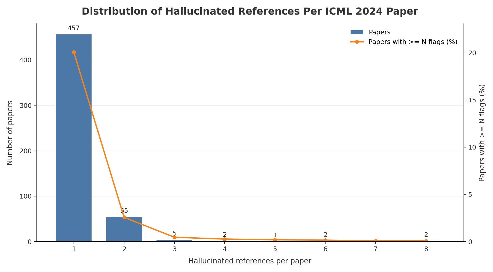

# ICML 2024 Hallucinated Reference Report

Generated: 2026-05-19 01:35:55 UTC

Source: `_workspace/icml2024/results/scan_report.json`

## Summary

| Metric | Count |
|---|---:|
| Hallucinated references | 623 |
| Papers with hallucinated references | 524 |
| Papers with >=3 hallucinated references | 12 |

## Distribution

| Hallucinated refs | Papers with exactly this count |
|---:|---:|
| 1 | 457 |
| 2 | 55 |
| 3 | 5 |
| 4 | 2 |
| 5 | 1 |
| 6 | 2 |
| 8 | 2 |

## Papers With >=3 Hallucinated References

| Rank | Hallucinated refs | Paper ID | Title | Total references | OpenReview |
|---:|---:|---|---|---:|---|
| 1 | 8 | `761UxjOTHB` | Recovering the Pre-Fine-Tuning Weights of Generative Models | 38 | [link](https://openreview.net/forum?id=761UxjOTHB) |
| 2 | 8 | `XDz9leJ9iK` | Position: Cracking the Code of Cascading Disparity Towards Marginalized Communities | 50 | [link](https://openreview.net/forum?id=XDz9leJ9iK) |
| 3 | 6 | `SWrwurHAeq` | SiT: Symmetry-invariant Transformers for Generalisation in Reinforcement Learning | 54 | [link](https://openreview.net/forum?id=SWrwurHAeq) |
| 4 | 6 | `bWUU0LwwMp` | Position: TrustLLM: Trustworthiness in Large Language Models | 362 | [link](https://openreview.net/forum?id=bWUU0LwwMp) |
| 5 | 5 | `6Kg9p8URlj` | Non-Vacuous Generalization Bounds for Large Language Models | 23 | [link](https://openreview.net/forum?id=6Kg9p8URlj) |
| 6 | 4 | `CJbhtpcyGL` | Position: On the Possibilities of AI-Generated Text Detection | 43 | [link](https://openreview.net/forum?id=CJbhtpcyGL) |
| 7 | 4 | `bq1JEgioLr` | SciBench: Evaluating College-Level Scientific Problem-Solving Abilities of Large Language Models | 22 | [link](https://openreview.net/forum?id=bq1JEgioLr) |
| 8 | 3 | `Hjwx3H6Vci` | Distribution Alignment Optimization through Neural Collapse for Long-tailed Classification | 62 | [link](https://openreview.net/forum?id=Hjwx3H6Vci) |
| 9 | 3 | `JvMLkGF2Ms` | Position: Building Guardrails for Large Language Models Requires Systematic Design | 63 | [link](https://openreview.net/forum?id=JvMLkGF2Ms) |
| 10 | 3 | `M2cwkGleRL` | Position: Key Claims in LLM Research Have a Long Tail of Footnotes | 100 | [link](https://openreview.net/forum?id=M2cwkGleRL) |
| 11 | 3 | `nYX7I6PsL7` | HAMLET: Graph Transformer Neural Operator for Partial Differential Equations | 42 | [link](https://openreview.net/forum?id=nYX7I6PsL7) |
| 12 | 3 | `vLtVGtEz5h` | Stereographic Spherical Sliced Wasserstein Distances | 58 | [link](https://openreview.net/forum?id=vLtVGtEz5h) |
