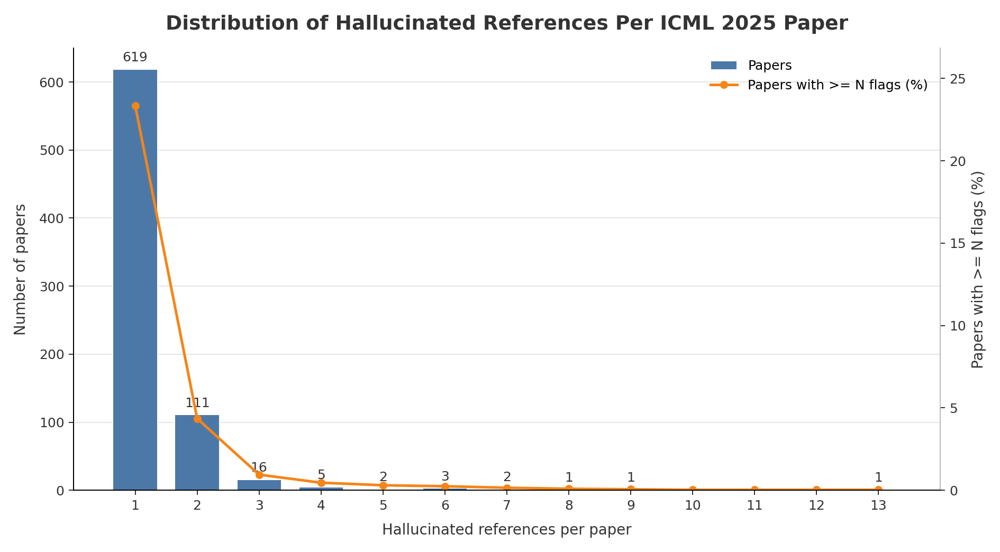

# ICML 2025 Hallucinated Reference Report

Generated: 2026-05-20 13:28:51 UTC

Source: `_workspace/icml2025/results/scan_report.json`

## Summary

| Metric | Count |
|---|---:|
| Hallucinated references | 981 |
| Papers with hallucinated references | 761 |
| Papers with >=3 hallucinated references | 31 |

## Distribution

| Hallucinated refs | Papers with exactly this count |
|---:|---:|
| 1 | 619 |
| 2 | 111 |
| 3 | 16 |
| 4 | 5 |
| 5 | 2 |
| 6 | 3 |
| 7 | 2 |
| 8 | 1 |
| 9 | 1 |
| 13 | 1 |

## Papers With >=3 Hallucinated References

| Rank | Hallucinated refs | Paper ID | Title | Total references | OpenReview |
|---:|---:|---|---|---:|---|
| 1 | 13 | `UFlyLkvyAE` | Graph Adaptive Autoregressive Moving Average Models | 115 | [link](https://openreview.net/forum?id=UFlyLkvyAE) |
| 2 | 9 | `LXILcnYTSl` | The Underlying Universal Statistical Structure of Natural Datasets | 57 | [link](https://openreview.net/forum?id=LXILcnYTSl) |
| 3 | 8 | `jwjvkWsePB` | Federated Oriented Learning: A Practical One-Shot Personalized Federated Learning Framework | 43 | [link](https://openreview.net/forum?id=jwjvkWsePB) |
| 4 | 7 | `1d1ssNedLv` | Balancing Model Efficiency and Performance: Adaptive Pruner for Long-tailed Data | 25 | [link](https://openreview.net/forum?id=1d1ssNedLv) |
| 5 | 7 | `A82tIFgJaK` | Harmonizing Geometry and Uncertainty: Diffusion with Hyperspheres | 34 | [link](https://openreview.net/forum?id=A82tIFgJaK) |
| 6 | 6 | `6mQv4fnsj0` | HybridGS: High-Efficiency Gaussian Splatting Data Compression using Dual-Channel Sparse Representation and Point Cloud Encoder | 34 | [link](https://openreview.net/forum?id=6mQv4fnsj0) |
| 7 | 6 | `CVQwQp9V1D` | More Than Meets the Eye: Enhancing Multi-Object Tracking Even with Prolonged Occlusions | 26 | [link](https://openreview.net/forum?id=CVQwQp9V1D) |
| 8 | 6 | `vhjuemZuRU` | SCENT: Robust Spatiotemporal Learning for Continuous Scientific Data via Scalable Conditioned Neural Fields | 34 | [link](https://openreview.net/forum?id=vhjuemZuRU) |
| 9 | 5 | `44gnGhurnZ` | A Dynamical Systems-Inspired Pruning Strategy for Addressing Oversmoothing in Graph Attention Networks | 31 | [link](https://openreview.net/forum?id=44gnGhurnZ) |
| 10 | 5 | `HV8vZDDoYc` | PyTDC: A multimodal machine learning training, evaluation, and inference platform for biomedical foundation models | 72 | [link](https://openreview.net/forum?id=HV8vZDDoYc) |
| 11 | 4 | `A31Ep22iQ7` | One Example Shown, Many Concepts Known! Counterexample-Driven Conceptual Reasoning in Mathematical LLMs | 31 | [link](https://openreview.net/forum?id=A31Ep22iQ7) |
| 12 | 4 | `Ii0DX4U439` | EmoGrowth: Incremental Multi-label Emotion Decoding with Augmented Emotional Relation Graph | 25 | [link](https://openreview.net/forum?id=Ii0DX4U439) |
| 13 | 4 | `YJ1My9ttEN` | Adaptive Flow Matching for Resolving Small-Scale Physics | 24 | [link](https://openreview.net/forum?id=YJ1My9ttEN) |
| 14 | 4 | `eU8vAuMlpH` | QPRL : Learning Optimal Policies with Quasi-Potential Functions for Asymmetric Traversal | 25 | [link](https://openreview.net/forum?id=eU8vAuMlpH) |
| 15 | 4 | `zuQROb7YBK` | A Mathematical Framework for AI-Human Integration in Work | 44 | [link](https://openreview.net/forum?id=zuQROb7YBK) |
| 16 | 3 | `4umRQdvuW5` | Geometry Informed Tokenization of Molecules for Language Model Generation | 52 | [link](https://openreview.net/forum?id=4umRQdvuW5) |
| 17 | 3 | `7Tp9zjP9At` | Neural Discovery in Mathematics: Do Machines Dream of Colored Planes? | 38 | [link](https://openreview.net/forum?id=7Tp9zjP9At) |
| 18 | 3 | `8AGdUCdDyI` | Controlling Neural Collapse Enhances Out-of-Distribution Detection and Transfer Learning | 62 | [link](https://openreview.net/forum?id=8AGdUCdDyI) |
| 19 | 3 | `Do1OdZzYHr` | Monte Carlo Tree Search for Comprehensive Exploration in LLM-Based Automatic Heuristic Design | 59 | [link](https://openreview.net/forum?id=Do1OdZzYHr) |
| 20 | 3 | `H78W6bTkuZ` | MetaOptimize: A Framework for Optimizing Step Sizes and Other Meta-parameters | 29 | [link](https://openreview.net/forum?id=H78W6bTkuZ) |
| 21 | 3 | `Hp53p5AU7X` | Reducing Variance of Stochastic Optimization for Approximating Nash Equilibria in Normal-Form Games | 31 | [link](https://openreview.net/forum?id=Hp53p5AU7X) |
| 22 | 3 | `OaC01wTE44` | One Image is Worth a Thousand Words: A Usability Preservable Text-Image Collaborative Erasing Framework | 51 | [link](https://openreview.net/forum?id=OaC01wTE44) |
| 23 | 3 | `RQwexjUCxm` | From Debate to Equilibrium: Belief‑Driven Multi‑Agent LLM Reasoning via Bayesian Nash Equilibrium | 36 | [link](https://openreview.net/forum?id=RQwexjUCxm) |
| 24 | 3 | `TcvjOSePic` | CLIMB: Data Foundations for Large Scale Multimodal Clinical Foundation Models | 52 | [link](https://openreview.net/forum?id=TcvjOSePic) |
| 25 | 3 | `ZwcMZ443BF` | Unraveling the Interplay between Carryover Effects and Reward Autocorrelations in Switchback Experiments | 88 | [link](https://openreview.net/forum?id=ZwcMZ443BF) |
| 26 | 3 | `emkdmORaj4` | Shifting Time: Time-series Forecasting with Khatri-Rao Neural Operators | 68 | [link](https://openreview.net/forum?id=emkdmORaj4) |
| 27 | 3 | `f5czhqYK3H` | Elucidating Flow Matching ODE Dynamics via Data Geometry and Denoisers | 41 | [link](https://openreview.net/forum?id=f5czhqYK3H) |
| 28 | 3 | `iYmV2xRSNW` | FrameBridge: Improving Image-to-Video Generation with Bridge Models | 63 | [link](https://openreview.net/forum?id=iYmV2xRSNW) |
| 29 | 3 | `k4KVhQd19x` | Dynamical Modeling of Behaviorally Relevant Spatiotemporal Patterns in Neural Imaging Data | 31 | [link](https://openreview.net/forum?id=k4KVhQd19x) |
| 30 | 3 | `pWtgTbiJTO` | Compact Matrix Quantum Group Equivariant Neural Networks | 58 | [link](https://openreview.net/forum?id=pWtgTbiJTO) |
| 31 | 3 | `wCBuHDe7Ud` | Optimizing Noise Distributions for Differential Privacy | 19 | [link](https://openreview.net/forum?id=wCBuHDe7Ud) |
