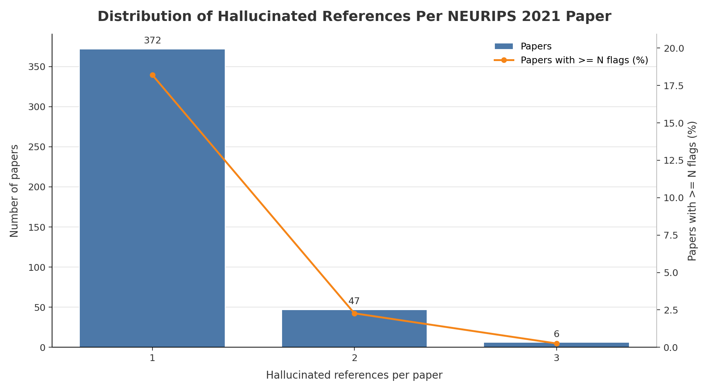

# NEURIPS 2021 Hallucinated Reference Report

Generated: 2026-05-19 01:36:03 UTC

Source: `_workspace/neurips2021/results/scan_report.json`

## Summary

| Metric | Count |
|---|---:|
| Hallucinated references | 484 |
| Papers with hallucinated references | 425 |
| Papers with >=3 hallucinated references | 6 |

## Distribution

| Hallucinated refs | Papers with exactly this count |
|---:|---:|
| 1 | 372 |
| 2 | 47 |
| 3 | 6 |

## Papers With >=3 Hallucinated References

| Rank | Hallucinated refs | Paper ID | Title | Total references | OpenReview |
|---:|---:|---|---|---:|---|
| 1 | 3 | `url_05546b0e38ab9175cd905eebcc6ebb76-Paper` | 05546B0E38Ab9175Cd905Eebcc6Ebb76-Paper | 37 | [link](https://papers.nips.cc/paper_files/paper/2021/file/05546b0e38ab9175cd905eebcc6ebb76-Paper.pdf) |
| 2 | 3 | `url_2b6921f2c64dee16ba21ebf17f3c2c92-Paper` | 2B6921F2C64Dee16Ba21Ebf17F3C2C92-Paper | 29 | [link](https://papers.nips.cc/paper_files/paper/2021/file/2b6921f2c64dee16ba21ebf17f3c2c92-Paper.pdf) |
| 3 | 3 | `url_8171ac2c5544a5cb54ac0f38bf477af4-Paper` | 8171Ac2C5544A5Cb54Ac0F38Bf477Af4-Paper | 45 | [link](https://papers.nips.cc/paper_files/paper/2021/file/8171ac2c5544a5cb54ac0f38bf477af4-Paper.pdf) |
| 4 | 3 | `url_84f7e69969dea92a925508f7c1f9579a-Paper` | 84F7E69969Dea92A925508F7C1F9579A-Paper | 34 | [link](https://papers.nips.cc/paper_files/paper/2021/file/84f7e69969dea92a925508f7c1f9579a-Paper.pdf) |
| 5 | 3 | `url_f6185f0ef02dcaec414a3171cd01c697-Paper` | F6185F0Ef02Dcaec414A3171Cd01C697-Paper | 69 | [link](https://papers.nips.cc/paper_files/paper/2021/file/f6185f0ef02dcaec414a3171cd01c697-Paper.pdf) |
| 6 | 3 | `url_ffbd6cbb019a1413183c8d08f2929307-Paper` | Ffbd6Cbb019A1413183C8D08F2929307-Paper | 23 | [link](https://papers.nips.cc/paper_files/paper/2021/file/ffbd6cbb019a1413183c8d08f2929307-Paper.pdf) |
