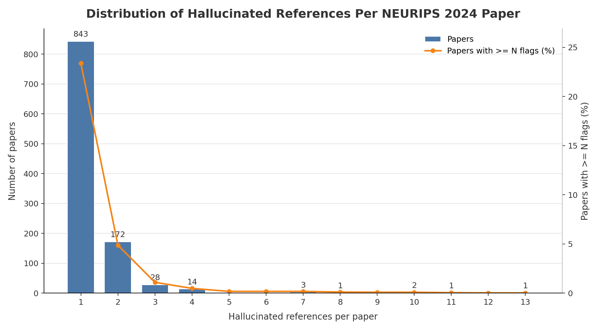

# NEURIPS 2024 Hallucinated Reference Report

Generated: 2026-05-20 02:47:38 UTC

Source: `_workspace/neurips2024/results/scan_report.json`

## Summary

| Metric | Count |
|---|---:|
| Hallucinated references | 1,400 |
| Papers with hallucinated references | 1,065 |
| Papers with >=3 hallucinated references | 50 |

## Distribution

| Hallucinated refs | Papers with exactly this count |
|---:|---:|
| 1 | 843 |
| 2 | 172 |
| 3 | 28 |
| 4 | 14 |
| 7 | 3 |
| 8 | 1 |
| 10 | 2 |
| 11 | 1 |
| 13 | 1 |

## Papers With >=3 Hallucinated References

| Rank | Hallucinated refs | Paper ID | Title | Total references | OpenReview |
|---:|---:|---|---|---:|---|
| 1 | 13 | `url_170dc3e41f2d03e327e04dbab0fccbfb-Paper-Conference` | 170Dc3E41F2D03E327E04Dbab0Fccbfb-Paper-Conference | 61 | [link](https://proceedings.neurips.cc/paper_files/paper/2024/file/170dc3e41f2d03e327e04dbab0fccbfb-Paper-Conference.pdf) |
| 2 | 11 | `url_fae2e63d2ffd3e67d238b5a372febc9b-Paper-Conference` | Fae2E63D2Ffd3E67D238B5A372Febc9B-Paper-Conference | 57 | [link](https://proceedings.neurips.cc/paper_files/paper/2024/file/fae2e63d2ffd3e67d238b5a372febc9b-Paper-Conference.pdf) |
| 3 | 10 | `url_ab7e02fd60e47e2a379d567f6b54f04e-Paper-Datasets_and_Benchmarks_Track` | Ab7E02Fd60E47E2A379D567F6B54F04E-Paper-Datasets And Benchmarks Track | 132 | [link](https://proceedings.neurips.cc/paper_files/paper/2024/file/ab7e02fd60e47e2a379d567f6b54f04e-Paper-Datasets_and_Benchmarks_Track.pdf) |
| 4 | 10 | `url_d6520fa7f71dc8e09ed5939a60a64218-Paper-Conference` | D6520Fa7F71Dc8E09Ed5939A60A64218-Paper-Conference | 27 | [link](https://proceedings.neurips.cc/paper_files/paper/2024/file/d6520fa7f71dc8e09ed5939a60a64218-Paper-Conference.pdf) |
| 5 | 8 | `url_4ae7d78ebbe48f772e31c5c3fcc04c43-Paper-Conference` | 4Ae7D78Ebbe48F772E31C5C3Fcc04C43-Paper-Conference | 35 | [link](https://proceedings.neurips.cc/paper_files/paper/2024/file/4ae7d78ebbe48f772e31c5c3fcc04c43-Paper-Conference.pdf) |
| 6 | 7 | `url_17fc467c11997914127c001fdc801bea-Paper-Datasets_and_Benchmarks_Track` | 17Fc467C11997914127C001Fdc801Bea-Paper-Datasets And Benchmarks Track | 33 | [link](https://proceedings.neurips.cc/paper_files/paper/2024/file/17fc467c11997914127c001fdc801bea-Paper-Datasets_and_Benchmarks_Track.pdf) |
| 7 | 7 | `url_7d60f19a8e5766910fd1798dc953869a-Paper-Conference` | 7D60F19A8E5766910Fd1798Dc953869A-Paper-Conference | 30 | [link](https://proceedings.neurips.cc/paper_files/paper/2024/file/7d60f19a8e5766910fd1798dc953869a-Paper-Conference.pdf) |
| 8 | 7 | `url_eced4a5fbc776e81b45e2f72447f0164-Paper-Datasets_and_Benchmarks_Track` | Eced4A5Fbc776E81B45E2F72447F0164-Paper-Datasets And Benchmarks Track | 35 | [link](https://proceedings.neurips.cc/paper_files/paper/2024/file/eced4a5fbc776e81b45e2f72447f0164-Paper-Datasets_and_Benchmarks_Track.pdf) |
| 9 | 4 | `3Odq2tGSpp` | Stylus: Automatic Adapter Selection for Diffusion Models | 46 | [link](https://openreview.net/forum?id=3Odq2tGSpp) |
| 10 | 4 | `url_17d25665bf6f46b7b3d32bd5cad3cbb2-Paper-Datasets_and_Benchmarks_Track` | 17D25665Bf6F46B7B3D32Bd5Cad3Cbb2-Paper-Datasets And Benchmarks Track | 52 | [link](https://proceedings.neurips.cc/paper_files/paper/2024/file/17d25665bf6f46b7b3d32bd5cad3cbb2-Paper-Datasets_and_Benchmarks_Track.pdf) |
| 11 | 4 | `url_39a746f507dc5087bd85cc39ded8c52f-Paper-Conference` | 39A746F507Dc5087Bd85Cc39Ded8C52F-Paper-Conference | 43 | [link](https://proceedings.neurips.cc/paper_files/paper/2024/file/39a746f507dc5087bd85cc39ded8c52f-Paper-Conference.pdf) |
| 12 | 4 | `url_49fb58cfd482a33619d48a5c5910cf3c-Paper-Conference` | 49Fb58Cfd482A33619D48A5C5910Cf3C-Paper-Conference | 26 | [link](https://proceedings.neurips.cc/paper_files/paper/2024/file/49fb58cfd482a33619d48a5c5910cf3c-Paper-Conference.pdf) |
| 13 | 4 | `url_4dd0a016d7d253d02473e4778414ab0b-Paper-Conference` | 4Dd0A016D7D253D02473E4778414Ab0B-Paper-Conference | 45 | [link](https://proceedings.neurips.cc/paper_files/paper/2024/file/4dd0a016d7d253d02473e4778414ab0b-Paper-Conference.pdf) |
| 14 | 4 | `url_796076672b00f54fb01d05a2e5fde363-Paper-Datasets_and_Benchmarks_Track` | 796076672B00F54Fb01D05A2E5Fde363-Paper-Datasets And Benchmarks Track | 61 | [link](https://proceedings.neurips.cc/paper_files/paper/2024/file/796076672b00f54fb01d05a2e5fde363-Paper-Datasets_and_Benchmarks_Track.pdf) |
| 15 | 4 | `url_8678da90126aa58326b2fc0254b33a8c-Paper-Conference` | 8678Da90126Aa58326B2Fc0254B33A8C-Paper-Conference | 99 | [link](https://proceedings.neurips.cc/paper_files/paper/2024/file/8678da90126aa58326b2fc0254b33a8c-Paper-Conference.pdf) |
| 16 | 4 | `url_b8adf038ba1da7a58afa2f88f0f0fb8e-Paper-Conference` | B8Adf038Ba1Da7A58Afa2F88F0F0Fb8E-Paper-Conference | 80 | [link](https://proceedings.neurips.cc/paper_files/paper/2024/file/b8adf038ba1da7a58afa2f88f0f0fb8e-Paper-Conference.pdf) |
| 17 | 4 | `url_bfa629625fd35bf5b880df464b584a57-Paper-Conference` | Bfa629625Fd35Bf5B880Df464B584A57-Paper-Conference | 51 | [link](https://proceedings.neurips.cc/paper_files/paper/2024/file/bfa629625fd35bf5b880df464b584a57-Paper-Conference.pdf) |
| 18 | 4 | `url_d4ab6d24758a0fe33604e1f4224ceea1-Paper-Conference` | D4Ab6D24758A0Fe33604E1F4224Ceea1-Paper-Conference | 73 | [link](https://proceedings.neurips.cc/paper_files/paper/2024/file/d4ab6d24758a0fe33604e1f4224ceea1-Paper-Conference.pdf) |
| 19 | 4 | `url_d758d7c0a88d741c8ca4637579c9df87-Paper-Datasets_and_Benchmarks_Track` | D758D7C0A88D741C8Ca4637579C9Df87-Paper-Datasets And Benchmarks Track | 59 | [link](https://proceedings.neurips.cc/paper_files/paper/2024/file/d758d7c0a88d741c8ca4637579c9df87-Paper-Datasets_and_Benchmarks_Track.pdf) |
| 20 | 4 | `url_f0430903a14db90e5ce96f101902d6d7-Paper-Datasets_and_Benchmarks_Track` | F0430903A14Db90E5Ce96F101902D6D7-Paper-Datasets And Benchmarks Track | 32 | [link](https://proceedings.neurips.cc/paper_files/paper/2024/file/f0430903a14db90e5ce96f101902d6d7-Paper-Datasets_and_Benchmarks_Track.pdf) |
| 21 | 4 | `url_f2b86cbc0b3e31dd001aeb516afbe1e2-Paper-Datasets_and_Benchmarks_Track` | F2B86Cbc0B3E31Dd001Aeb516Afbe1E2-Paper-Datasets And Benchmarks Track | 16 | [link](https://proceedings.neurips.cc/paper_files/paper/2024/file/f2b86cbc0b3e31dd001aeb516afbe1e2-Paper-Datasets_and_Benchmarks_Track.pdf) |
| 22 | 4 | `url_fe61e76998bbe3db53a6a48fa58207e9-Paper-Conference` | Fe61E76998Bbe3Db53A6A48Fa58207E9-Paper-Conference | 36 | [link](https://proceedings.neurips.cc/paper_files/paper/2024/file/fe61e76998bbe3db53a6a48fa58207e9-Paper-Conference.pdf) |
| 23 | 3 | `url_09887fac6cb071922e870090ce32aeff-Paper-Conference` | 09887Fac6Cb071922E870090Ce32Aeff-Paper-Conference | 26 | [link](https://proceedings.neurips.cc/paper_files/paper/2024/file/09887fac6cb071922e870090ce32aeff-Paper-Conference.pdf) |
| 24 | 3 | `url_0fd489e5e393f61b355be86ed4c24a54-Paper-Conference` | 0Fd489E5E393F61B355Be86Ed4C24A54-Paper-Conference | 44 | [link](https://proceedings.neurips.cc/paper_files/paper/2024/file/0fd489e5e393f61b355be86ed4c24a54-Paper-Conference.pdf) |
| 25 | 3 | `url_12143893d9d37c3569dda800b95cabd9-Paper-Conference` | 12143893D9D37C3569Dda800B95Cabd9-Paper-Conference | 42 | [link](https://proceedings.neurips.cc/paper_files/paper/2024/file/12143893d9d37c3569dda800b95cabd9-Paper-Conference.pdf) |
| 26 | 3 | `url_128911cc894d57bcae78074a9551c132-Paper-Conference` | 128911Cc894D57Bcae78074A9551C132-Paper-Conference | 49 | [link](https://proceedings.neurips.cc/paper_files/paper/2024/file/128911cc894d57bcae78074a9551c132-Paper-Conference.pdf) |
| 27 | 3 | `url_15add6732964d5b1f0954058bf3ccc88-Paper-Datasets_and_Benchmarks_Track` | 15Add6732964D5B1F0954058Bf3Ccc88-Paper-Datasets And Benchmarks Track | 33 | [link](https://proceedings.neurips.cc/paper_files/paper/2024/file/15add6732964d5b1f0954058bf3ccc88-Paper-Datasets_and_Benchmarks_Track.pdf) |
| 28 | 3 | `url_1bf4cad47f5a54c98fbe7d10516ebf77-Paper-Conference` | 1Bf4Cad47F5A54C98Fbe7D10516Ebf77-Paper-Conference | 75 | [link](https://proceedings.neurips.cc/paper_files/paper/2024/file/1bf4cad47f5a54c98fbe7d10516ebf77-Paper-Conference.pdf) |
| 29 | 3 | `url_1e1cf05517b959c1ce5934734efc421b-Paper-Conference` | 1E1Cf05517B959C1Ce5934734Efc421B-Paper-Conference | 48 | [link](https://proceedings.neurips.cc/paper_files/paper/2024/file/1e1cf05517b959c1ce5934734efc421b-Paper-Conference.pdf) |
| 30 | 3 | `url_1e6dcc16ffa7ced2228d1f2fdc8b5adf-Paper-Conference` | 1E6Dcc16Ffa7Ced2228D1F2Fdc8B5Adf-Paper-Conference | 32 | [link](https://proceedings.neurips.cc/paper_files/paper/2024/file/1e6dcc16ffa7ced2228d1f2fdc8b5adf-Paper-Conference.pdf) |
| 31 | 3 | `url_21a7b312c42af86b3cd17a26a8ec499e-Paper-Conference` | 21A7B312C42Af86B3Cd17A26A8Ec499E-Paper-Conference | 34 | [link](https://proceedings.neurips.cc/paper_files/paper/2024/file/21a7b312c42af86b3cd17a26a8ec499e-Paper-Conference.pdf) |
| 32 | 3 | `url_2cd36d327f33d47b372d4711edd08de0-Paper-Conference` | 2Cd36D327F33D47B372D4711Edd08De0-Paper-Conference | 57 | [link](https://proceedings.neurips.cc/paper_files/paper/2024/file/2cd36d327f33d47b372d4711edd08de0-Paper-Conference.pdf) |
| 33 | 3 | `url_36850592258c8c41cecdaa3dea5ff7de-Paper-Datasets_and_Benchmarks_Track` | 36850592258C8C41Cecdaa3Dea5Ff7De-Paper-Datasets And Benchmarks Track | 49 | [link](https://proceedings.neurips.cc/paper_files/paper/2024/file/36850592258c8c41cecdaa3dea5ff7de-Paper-Datasets_and_Benchmarks_Track.pdf) |
| 34 | 3 | `url_460e1f983103d38832e6c79cbaa91471-Paper-Conference` | 460E1F983103D38832E6C79Cbaa91471-Paper-Conference | 67 | [link](https://proceedings.neurips.cc/paper_files/paper/2024/file/460e1f983103d38832e6c79cbaa91471-Paper-Conference.pdf) |
| 35 | 3 | `url_4b06cdddb1cde6624c0be1465c7b800f-Paper-Conference` | 4B06Cdddb1Cde6624C0Be1465C7B800F-Paper-Conference | 46 | [link](https://proceedings.neurips.cc/paper_files/paper/2024/file/4b06cdddb1cde6624c0be1465c7b800f-Paper-Conference.pdf) |
| 36 | 3 | `url_53f2c82c6b165a963b353194113ee71e-Paper-Conference` | 53F2C82C6B165A963B353194113Ee71E-Paper-Conference | 86 | [link](https://proceedings.neurips.cc/paper_files/paper/2024/file/53f2c82c6b165a963b353194113ee71e-Paper-Conference.pdf) |
| 37 | 3 | `url_54ece32fe923c26b3de15d0da182e008-Paper-Conference` | 54Ece32Fe923C26B3De15D0Da182E008-Paper-Conference | 23 | [link](https://proceedings.neurips.cc/paper_files/paper/2024/file/54ece32fe923c26b3de15d0da182e008-Paper-Conference.pdf) |
| 38 | 3 | `url_6c49d2ad55e50c5ebc1002fdc50e48e5-Paper-Conference` | 6C49D2Ad55E50C5Ebc1002Fdc50E48E5-Paper-Conference | 66 | [link](https://proceedings.neurips.cc/paper_files/paper/2024/file/6c49d2ad55e50c5ebc1002fdc50e48e5-Paper-Conference.pdf) |
| 39 | 3 | `url_71d9a840a7f04339ca271c10a0f4fbd4-Paper-Conference` | 71D9A840A7F04339Ca271C10A0F4Fbd4-Paper-Conference | 21 | [link](https://proceedings.neurips.cc/paper_files/paper/2024/file/71d9a840a7f04339ca271c10a0f4fbd4-Paper-Conference.pdf) |
| 40 | 3 | `url_984dd3db213db2d1454a163b65b84d08-Paper-Datasets_and_Benchmarks_Track` | 984Dd3Db213Db2D1454A163B65B84D08-Paper-Datasets And Benchmarks Track | 32 | [link](https://proceedings.neurips.cc/paper_files/paper/2024/file/984dd3db213db2d1454a163b65b84d08-Paper-Datasets_and_Benchmarks_Track.pdf) |
| 41 | 3 | `url_990488efad2c59c619d2b1006a1986d9-Paper-Conference` | 990488Efad2C59C619D2B1006A1986D9-Paper-Conference | 35 | [link](https://proceedings.neurips.cc/paper_files/paper/2024/file/990488efad2c59c619d2b1006a1986d9-Paper-Conference.pdf) |
| 42 | 3 | `url_b3ac808c09f98444090a8f6c2d4bd1dc-Paper-Conference` | B3Ac808C09F98444090A8F6C2D4Bd1Dc-Paper-Conference | 46 | [link](https://proceedings.neurips.cc/paper_files/paper/2024/file/b3ac808c09f98444090a8f6c2d4bd1dc-Paper-Conference.pdf) |
| 43 | 3 | `url_b736c4b0b38876c9249db9bd900c1a86-Paper-Conference` | B736C4B0B38876C9249Db9Bd900C1A86-Paper-Conference | 51 | [link](https://proceedings.neurips.cc/paper_files/paper/2024/file/b736c4b0b38876c9249db9bd900c1a86-Paper-Conference.pdf) |
| 44 | 3 | `url_c1ab28d0fe0bfb53067a1af7e578cd7d-Paper-Conference` | C1Ab28D0Fe0Bfb53067A1Af7E578Cd7D-Paper-Conference | 30 | [link](https://proceedings.neurips.cc/paper_files/paper/2024/file/c1ab28d0fe0bfb53067a1af7e578cd7d-Paper-Conference.pdf) |
| 45 | 3 | `url_cd4b49379efac6e84186a3ffce108c37-Paper-Conference` | Cd4B49379Efac6E84186A3Ffce108C37-Paper-Conference | 49 | [link](https://proceedings.neurips.cc/paper_files/paper/2024/file/cd4b49379efac6e84186a3ffce108c37-Paper-Conference.pdf) |
| 46 | 3 | `url_d06c529fe328638e6ce420b89999f636-Paper-Conference` | D06C529Fe328638E6Ce420B89999F636-Paper-Conference | 34 | [link](https://proceedings.neurips.cc/paper_files/paper/2024/file/d06c529fe328638e6ce420b89999f636-Paper-Conference.pdf) |
| 47 | 3 | `url_d5a1f97d2b922da92e880d13b7d2bf02-Paper-Conference` | D5A1F97D2B922Da92E880D13B7D2Bf02-Paper-Conference | 23 | [link](https://proceedings.neurips.cc/paper_files/paper/2024/file/d5a1f97d2b922da92e880d13b7d2bf02-Paper-Conference.pdf) |
| 48 | 3 | `url_da36187b68fb72c3fe1c0eaec638221c-Paper-Conference` | Da36187B68Fb72C3Fe1C0Eaec638221C-Paper-Conference | 37 | [link](https://proceedings.neurips.cc/paper_files/paper/2024/file/da36187b68fb72c3fe1c0eaec638221c-Paper-Conference.pdf) |
| 49 | 3 | `url_de85d3cff8512f72fd50b862979f1731-Paper-Conference` | De85D3Cff8512F72Fd50B862979F1731-Paper-Conference | 47 | [link](https://proceedings.neurips.cc/paper_files/paper/2024/file/de85d3cff8512f72fd50b862979f1731-Paper-Conference.pdf) |
| 50 | 3 | `url_fb23cf87a9e04d7677b73c47acd060ef-Paper-Conference` | Fb23Cf87A9E04D7677B73C47Acd060Ef-Paper-Conference | 37 | [link](https://proceedings.neurips.cc/paper_files/paper/2024/file/fb23cf87a9e04d7677b73c47acd060ef-Paper-Conference.pdf) |
