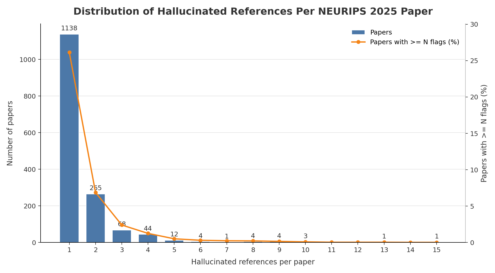

# NEURIPS 2025 Hallucinated Reference Report

Generated: 2026-05-19 01:36:19 UTC

Source: `_workspace/neurips2025/results/scan_report.json`

## Summary

| Metric | Count |
|---|---:|
| Hallucinated references | 2,265 |
| Papers with hallucinated references | 1,545 |
| Papers with >=3 hallucinated references | 142 |

## Distribution

| Hallucinated refs | Papers with exactly this count |
|---:|---:|
| 1 | 1,138 |
| 2 | 265 |
| 3 | 68 |
| 4 | 44 |
| 5 | 12 |
| 6 | 4 |
| 7 | 1 |
| 8 | 4 |
| 9 | 4 |
| 10 | 3 |
| 13 | 1 |
| 15 | 1 |

## Papers With >=3 Hallucinated References

| Rank | Hallucinated refs | Paper ID | Title | Total references | OpenReview |
|---:|---:|---|---|---:|---|
| 1 | 15 | `ZeFMtRBy4Z` | REVE: A Foundation Model for EEG - Adapting to Any Setup with Large-Scale Pretraining on 25,000 Subjects | 76 | [link](https://openreview.net/forum?id=ZeFMtRBy4Z) |
| 2 | 13 | `6ZkcC9NmGU` | ItDPDM: Information-Theoretic Discrete Poisson Diffusion Model | 37 | [link](https://openreview.net/forum?id=6ZkcC9NmGU) |
| 3 | 10 | `HzGZVYi8fK` | Position: Biology is the Challenge Physics-Informed ML Needs to Evolve | 62 | [link](https://openreview.net/forum?id=HzGZVYi8fK) |
| 4 | 10 | `mHCOVlFXTw` | PRING: Rethinking Protein-Protein Interaction Prediction from Pairs to Graphs | 41 | [link](https://openreview.net/forum?id=mHCOVlFXTw) |
| 5 | 10 | `upU88pUpzX` | Support Vector Generation: Kernelizing Large Language Models for Efficient Zero‑Shot NLP | 23 | [link](https://openreview.net/forum?id=upU88pUpzX) |
| 6 | 9 | `CH76rSKWZr` | Test-Time Adaptation of Vision-Language Models for Open-Vocabulary Semantic Segmentation | 40 | [link](https://openreview.net/forum?id=CH76rSKWZr) |
| 7 | 9 | `VUz3Jcomsv` | AutoOpt: A Dataset and a Unified Framework for Automating Optimization Problem Solving | 43 | [link](https://openreview.net/forum?id=VUz3Jcomsv) |
| 8 | 9 | `kWGJa9ZO3M` | Watch and Listen: Understanding Audio-Visual-Speech Moments with Multimodal LLM | 27 | [link](https://openreview.net/forum?id=kWGJa9ZO3M) |
| 9 | 9 | `rZ2nSt1X58` | Optimization Inspired Few-Shot Adaptation for Large Language Models | 61 | [link](https://openreview.net/forum?id=rZ2nSt1X58) |
| 10 | 8 | `PFRandBfSz` | Position: If Innovation in AI systematically Violates Fundamental Rights, Is It Innovation at All? | 74 | [link](https://openreview.net/forum?id=PFRandBfSz) |
| 11 | 8 | `bbQV3GQ6Zy` | PAC Bench: Do Foundation Models Understand Prerequisites for Executing Manipulation Policies? | 22 | [link](https://openreview.net/forum?id=bbQV3GQ6Zy) |
| 12 | 8 | `fcLVqvyiqV` | HMARL-CBF – Hierarchical Multi-Agent Reinforcement Learning with Control Barrier Functions for Safety-Critical Autonomous Systems | 63 | [link](https://openreview.net/forum?id=fcLVqvyiqV) |
| 13 | 8 | `mXBFoHDuil` | Statistically Valid Post-Deployment Monitoring Should Be Standard for AI-Based Digital Health | 57 | [link](https://openreview.net/forum?id=mXBFoHDuil) |
| 14 | 7 | `VswQY0peMr` | Neural Hamiltonian Diffusions for Modeling Structured Geometric Dynamics | 32 | [link](https://openreview.net/forum?id=VswQY0peMr) |
| 15 | 6 | `AmZ7uHDJiR` | NFL-BA: Near-Field Light Bundle Adjustment for SLAM in Dynamic Lighting | 45 | [link](https://openreview.net/forum?id=AmZ7uHDJiR) |
| 16 | 6 | `PhHrlDKcx1` | Discovering Latent Graphs with GFlowNets for Diverse Conditional Image Generation | 66 | [link](https://openreview.net/forum?id=PhHrlDKcx1) |
| 17 | 6 | `Zb3QO7HLIj` | FLAME: Fast Long-context Adaptive Memory for Event-based Vision | 67 | [link](https://openreview.net/forum?id=Zb3QO7HLIj) |
| 18 | 6 | `hwEhsFLPh1` | Memory-Integrated Reconfigurable Adapters: A Unified Framework for Settings with Multiple Tasks | 62 | [link](https://openreview.net/forum?id=hwEhsFLPh1) |
| 19 | 5 | `8FZ4oRWJjq` | CPRet: A Dataset, Benchmark, and Model for Retrieval in Competitive Programming | 24 | [link](https://openreview.net/forum?id=8FZ4oRWJjq) |
| 20 | 5 | `MNSiBGNAvx` | SafePTR: Token-Level Jailbreak Defense in Multimodal LLMs via Prune-then-Restore Mechanism | 13 | [link](https://openreview.net/forum?id=MNSiBGNAvx) |
| 21 | 5 | `R0B1z8dQcV` | AdvPrefix: An Objective for Nuanced LLM Jailbreaks | 30 | [link](https://openreview.net/forum?id=R0B1z8dQcV) |
| 22 | 5 | `SuewCbLYBS` | Fuz-RL: A Fuzzy-Guided Robust Framework for Safe Reinforcement Learning under Uncertainty | 31 | [link](https://openreview.net/forum?id=SuewCbLYBS) |
| 23 | 5 | `Z5pd8iHP2q` | GOATex: Geometry & Occlusion-Aware Texturing | 45 | [link](https://openreview.net/forum?id=Z5pd8iHP2q) |
| 24 | 5 | `b7waOsMnq8` | Sharp Gaussian approximations for Decentralized Federated Learning | 60 | [link](https://openreview.net/forum?id=b7waOsMnq8) |
| 25 | 5 | `hNh3V1DXs5` | On the Sample Complexity Bounds of Bilevel Reinforcement Learning | 6 | [link](https://openreview.net/forum?id=hNh3V1DXs5) |
| 26 | 5 | `hlpRj222RG` | PixPerfect: Seamless Latent Diffusion Local Editing with Discriminative Pixel-Space Refinement | 48 | [link](https://openreview.net/forum?id=hlpRj222RG) |
| 27 | 5 | `q5QaTQcUbS` | 3DLLM-Mem: Long-Term Spatial-Temporal Memory for Embodied 3D Large Language Model | 49 | [link](https://openreview.net/forum?id=q5QaTQcUbS) |
| 28 | 5 | `qmbG6u7DK0` | MOTION: Multi-Sculpt Evolutionary Coarsening for Federated Continual Graph Learning | 38 | [link](https://openreview.net/forum?id=qmbG6u7DK0) |
| 29 | 5 | `sMtiGB2YZT` | Panacea: Mitigating Harmful Fine-tuning for Large Language Models via Post-fine-tuning Perturbation | 75 | [link](https://openreview.net/forum?id=sMtiGB2YZT) |
| 30 | 5 | `zho5kN8jTn` | Optimal Adjustment Sets for Nonparametric Estimation of Weighted Controlled Direct Effect | 30 | [link](https://openreview.net/forum?id=zho5kN8jTn) |
| 31 | 4 | `28bjSsEpMP` | GUARD: Constructing Realistic Two-Player Matrix and Security Games for Benchmarking Game-Theoretic Algorithms | 23 | [link](https://openreview.net/forum?id=28bjSsEpMP) |
| 32 | 4 | `4TP1SuInE5` | Anti-Aliased 2D Gaussian Splatting | 58 | [link](https://openreview.net/forum?id=4TP1SuInE5) |
| 33 | 4 | `8Q4xTf2SYC` | Heterogeneous Adversarial Play in Interactive Environments | 76 | [link](https://openreview.net/forum?id=8Q4xTf2SYC) |
| 34 | 4 | `A3aV30YGqP` | GTPBD: A Fine-Grained Global Terraced Parcel and Boundary Dataset | 27 | [link](https://openreview.net/forum?id=A3aV30YGqP) |
| 35 | 4 | `A9jXG3FUMT` | FAPEX: Fractional Amplitude-Phase Expressor for Robust Cross-Subject Seizure Prediction | 37 | [link](https://openreview.net/forum?id=A9jXG3FUMT) |
| 36 | 4 | `AHEKhff4Oa` | PhysCtrl: Generative Physics for Controllable and Physics-Grounded Video Generation | 52 | [link](https://openreview.net/forum?id=AHEKhff4Oa) |
| 37 | 4 | `BqVIt5Dxxh` | EmoNet-Face: An Expert-Annotated Benchmark for Synthetic Emotion Recognition | 25 | [link](https://openreview.net/forum?id=BqVIt5Dxxh) |
| 38 | 4 | `DS1XSAPvKs` | Position: Machine Learning Conferences Should Establish a "Refutations and Critiques" Track | 78 | [link](https://openreview.net/forum?id=DS1XSAPvKs) |
| 39 | 4 | `Di5apl8HSH` | How to build a consistency model: Learning flow maps via self-distillation | 37 | [link](https://openreview.net/forum?id=Di5apl8HSH) |
| 40 | 4 | `Dr06Wjh45k` | Frequency-Aware Token Reduction for Efficient Vision Transformer | 26 | [link](https://openreview.net/forum?id=Dr06Wjh45k) |
| 41 | 4 | `E6ZdfjtoiX` | Efficient Data Selection at Scale via Influence Distillation | 43 | [link](https://openreview.net/forum?id=E6ZdfjtoiX) |
| 42 | 4 | `ILP0eZAor6` | Optimal Dynamic Regret by Transformers for Non-Stationary Reinforcement Learning | 35 | [link](https://openreview.net/forum?id=ILP0eZAor6) |
| 43 | 4 | `IjMZfMVyLF` | CATransformers: Carbon Aware Transformers Through Joint Model-Hardware Optimization | 53 | [link](https://openreview.net/forum?id=IjMZfMVyLF) |
| 44 | 4 | `MZwGG87Jev` | RiverMamba: A State Space Model for Global River Discharge and Flood Forecasting | 37 | [link](https://openreview.net/forum?id=MZwGG87Jev) |
| 45 | 4 | `QFOhUboCvp` | Object Concepts Emerge from Motion | 59 | [link](https://openreview.net/forum?id=QFOhUboCvp) |
| 46 | 4 | `QtnCPZMxYg` | Trajectory Graph Learning: Aligning with Long Trajectories in Reinforcement Learning Without Reward Design | 21 | [link](https://openreview.net/forum?id=QtnCPZMxYg) |
| 47 | 4 | `RT3Jby7v21` | Embracing Contradiction: Theoretical Inconsistency Will Not Impede the Road of Building Responsible AI Systems | 56 | [link](https://openreview.net/forum?id=RT3Jby7v21) |
| 48 | 4 | `STKDn1LBam` | A Few Moments Please: Scalable Graphon Learning via Moment Matching | 35 | [link](https://openreview.net/forum?id=STKDn1LBam) |
| 49 | 4 | `T3DF4yxcPz` | Multiscale guidance of protein structure prediction with heterogeneous cryo-EM data | 27 | [link](https://openreview.net/forum?id=T3DF4yxcPz) |
| 50 | 4 | `UAc6RL9Tt4` | Neural-Driven Image Editing | 50 | [link](https://openreview.net/forum?id=UAc6RL9Tt4) |
| 51 | 4 | `Xic1sPAmfC` | Neural MJD: Neural Non-Stationary Merton Jump Diffusion for Time Series Prediction | 46 | [link](https://openreview.net/forum?id=Xic1sPAmfC) |
| 52 | 4 | `XxR70zr9Sf` | Linear Transformers Implicitly Discover Unified Numerical Algorithms | 25 | [link](https://openreview.net/forum?id=XxR70zr9Sf) |
| 53 | 4 | `ZtB34bQI54` | Constrained Entropic Unlearning: A Primal-Dual Framework for Large Language Models | 42 | [link](https://openreview.net/forum?id=ZtB34bQI54) |
| 54 | 4 | `a3l3K9khbL` | Quantization Error Propagation: Revisiting Layer-Wise Post-Training Quantization | 39 | [link](https://openreview.net/forum?id=a3l3K9khbL) |
| 55 | 4 | `am6RR85mnc` | SciArena: An Open Evaluation Platform for Non-Verifiable Scientific Literature-Grounded Tasks | 59 | [link](https://openreview.net/forum?id=am6RR85mnc) |
| 56 | 4 | `bPNzBXl1n7` | Perturbation Bounds for Low-Rank Inverse Approximations under Noise | 41 | [link](https://openreview.net/forum?id=bPNzBXl1n7) |
| 57 | 4 | `by8N8HCqAG` | Exponential Convergence Guarantees for Iterative Markovian Fitting | 26 | [link](https://openreview.net/forum?id=by8N8HCqAG) |
| 58 | 4 | `cvSWTtTGSZ` | EndoBench: A Comprehensive Evaluation of Multi-Modal Large Language Models for Endoscopy Analysis | 58 | [link](https://openreview.net/forum?id=cvSWTtTGSZ) |
| 59 | 4 | `dfcQFL89OM` | Causality Meets Locality: Provably Generalizable and Scalable Policy Learning for Networked Systems | 32 | [link](https://openreview.net/forum?id=dfcQFL89OM) |
| 60 | 4 | `dhWkIa3NFu` | Open CaptchaWorld: A Comprehensive Web-based Platform for Testing and Benchmarking Multimodal LLM Agents | 28 | [link](https://openreview.net/forum?id=dhWkIa3NFu) |
| 61 | 4 | `emM7U3WKMO` | Diversity Is All You Need for Contrastive Learning: Spectral Bounds on Gradient Magnitudes | 21 | [link](https://openreview.net/forum?id=emM7U3WKMO) |
| 62 | 4 | `f6AoMP75dy` | From Kolmogorov to Cauchy: Shallow XNet Surpasses KANs | 16 | [link](https://openreview.net/forum?id=f6AoMP75dy) |
| 63 | 4 | `fbTGCEfztk` | PhysDiff-VTON: Cross-Domain Physics Modeling and Trajectory Optimization for Virtual Try-On | 32 | [link](https://openreview.net/forum?id=fbTGCEfztk) |
| 64 | 4 | `hYVhxKGD8Y` | AGI-Elo: How Far Are We From Mastering A Task? | 54 | [link](https://openreview.net/forum?id=hYVhxKGD8Y) |
| 65 | 4 | `k4wAXbEPD6` | Individual Regret in Cooperative Stochastic Multi-Armed Bandits | 31 | [link](https://openreview.net/forum?id=k4wAXbEPD6) |
| 66 | 4 | `kkELPdW6X7` | Towards Evaluating Proactive Risk Awareness of Multimodal Language Models | 54 | [link](https://openreview.net/forum?id=kkELPdW6X7) |
| 67 | 4 | `onhjdWCxZY` | HiFC: High-efficiency Flash-based KV Cache Swapping for Scaling LLM Inference | 24 | [link](https://openreview.net/forum?id=onhjdWCxZY) |
| 68 | 4 | `qjV3YHW3PD` | Enhancing Safety in Reinforcement Learning with Human Feedback via Rectified Policy Optimization | 42 | [link](https://openreview.net/forum?id=qjV3YHW3PD) |
| 69 | 4 | `tiGFiCrmKm` | Finding Low-Rank Matrix Weights in DNNs via Riemannian Optimization: RAdaGrad and RAdamW | 38 | [link](https://openreview.net/forum?id=tiGFiCrmKm) |
| 70 | 4 | `tuA2R6gZEA` | LongMagpie: A Self-synthesis Method for Generating Large-scale Long-context Instructions | 31 | [link](https://openreview.net/forum?id=tuA2R6gZEA) |
| 71 | 4 | `vFae5rRman` | Position: Benchmarking is Broken - Don't Let AI be Its Own Judge | 43 | [link](https://openreview.net/forum?id=vFae5rRman) |
| 72 | 4 | `wZGe1Kqs8G` | OceanBench: A Benchmark for Data-Driven Global Ocean Forecasting systems | 14 | [link](https://openreview.net/forum?id=wZGe1Kqs8G) |
| 73 | 4 | `xGmS1i0pDq` | Nonlinearly Preconditioned Gradient Methods: Momentum and Stochastic Analysis | 33 | [link](https://openreview.net/forum?id=xGmS1i0pDq) |
| 74 | 4 | `yADrJyaBJl` | SVRPBench: A Realistic Benchmark for Stochastic Vehicle Routing Problem | 24 | [link](https://openreview.net/forum?id=yADrJyaBJl) |
| 75 | 3 | `0JSolJVzjd` | Improved Approximation Algorithms for Chromatic and Pseudometric-Weighted Correlation Clustering | 23 | [link](https://openreview.net/forum?id=0JSolJVzjd) |
| 76 | 3 | `1bb974Q4jJ` | No-Regret Thompson Sampling for Finite-Horizon Markov Decision Processes with Gaussian Processes | 46 | [link](https://openreview.net/forum?id=1bb974Q4jJ) |
| 77 | 3 | `2ncMTlR9nC` | CamEdit: Continuous Camera Parameter Control for Photorealistic Image Editing | 54 | [link](https://openreview.net/forum?id=2ncMTlR9nC) |
| 78 | 3 | `4QRoLzD11x` | From Softmax to Score: Transformers Can Effectively Implement In-Context Denoising Steps | 9 | [link](https://openreview.net/forum?id=4QRoLzD11x) |
| 79 | 3 | `4vLYwlA3X5` | Sheetpedia: A 300K-Spreadsheet Corpus for Spreadsheet Intelligence and LLM Fine-Tuning | 19 | [link](https://openreview.net/forum?id=4vLYwlA3X5) |
| 80 | 3 | `5NkfjxMpWe` | PerceptionLM: Open-Access Data and Models for Detailed Visual Understanding | 138 | [link](https://openreview.net/forum?id=5NkfjxMpWe) |
| 81 | 3 | `6BpKATZQd8` | MM-OPERA: Benchmarking Open-ended Association Reasoning for Large Vision-Language Models | 49 | [link](https://openreview.net/forum?id=6BpKATZQd8) |
| 82 | 3 | `6NczjqEcO5` | On the SAC-BL Algorithm for Anomaly Detection | 19 | [link](https://openreview.net/forum?id=6NczjqEcO5) |
| 83 | 3 | `6rpy7X1Of8` | Delving into Large Language Models for Effective Time-Series Anomaly Detection | 50 | [link](https://openreview.net/forum?id=6rpy7X1Of8) |
| 84 | 3 | `7WDFZKtf7q` | mmWalk: Towards Multi-modal Multi-view Walking Assistance | 29 | [link](https://openreview.net/forum?id=7WDFZKtf7q) |
| 85 | 3 | `8XVlFz3peB` | Neural Tangent Knowledge Distillation for Optical Convolutional Networks | 32 | [link](https://openreview.net/forum?id=8XVlFz3peB) |
| 86 | 3 | `8ZiElzQxf1` | Inference-Time Hyper-Scaling with KV Cache Compression | 48 | [link](https://openreview.net/forum?id=8ZiElzQxf1) |
| 87 | 3 | `9VxTXAUH7G` | R&D-Agent-Quant: A Multi-Agent Framework for Data-Centric Factors and Model Joint Optimization | 46 | [link](https://openreview.net/forum?id=9VxTXAUH7G) |
| 88 | 3 | `BeFjjyzWOJ` | A Technical Report on “Erasing the Invisible”: The 2024 NeurIPS Competition on Stress Testing Image Watermarks | 16 | [link](https://openreview.net/forum?id=BeFjjyzWOJ) |
| 89 | 3 | `EKJhU5ioSo` | GAM-Agent: Game-Theoretic and Uncertainty-Aware Collaboration for Complex Visual Reasoning | 55 | [link](https://openreview.net/forum?id=EKJhU5ioSo) |
| 90 | 3 | `EtQ2YAWHYs` | OligoGym: Curated Datasets and Benchmarks for Oligonucleotide Drug Discovery | 18 | [link](https://openreview.net/forum?id=EtQ2YAWHYs) |
| 91 | 3 | `FjxyAotxtT` | Don’t Give Up on Democratizing AI for the Wrong Reasons | 47 | [link](https://openreview.net/forum?id=FjxyAotxtT) |
| 92 | 3 | `GPTI9GNAYH` | Fourier Token Merging: Understanding and Capitalizing Frequency Domain for Efficient Image Generation | 21 | [link](https://openreview.net/forum?id=GPTI9GNAYH) |
| 93 | 3 | `H8fscnm6Xx` | Unextractable Protocol Models: Collaborative Training and Inference without Weight Materialization | 39 | [link](https://openreview.net/forum?id=H8fscnm6Xx) |
| 94 | 3 | `KM2XzHq2Rm` | Integral Imprecise Probability Metrics | 83 | [link](https://openreview.net/forum?id=KM2XzHq2Rm) |
| 95 | 3 | `KWFnxtO78b` | Convex Potential Mirror Langevin Algorithm for Efficient Sampling of Energy-Based Models | 40 | [link](https://openreview.net/forum?id=KWFnxtO78b) |
| 96 | 3 | `M96edY67nS` | Repurposing AlphaFold3-like Protein Folding Models for Antibody Sequence and Structure Co-design | 34 | [link](https://openreview.net/forum?id=M96edY67nS) |
| 97 | 3 | `OM0Qkq9xtY` | Brain network science modelling of sparse neural networks enables Transformers and LLMs to perform as fully connected | 34 | [link](https://openreview.net/forum?id=OM0Qkq9xtY) |
| 98 | 3 | `PU4AcbqKp4` | ChemX: A Collection of Chemistry Datasets for Benchmarking Automated Information Extraction | 19 | [link](https://openreview.net/forum?id=PU4AcbqKp4) |
| 99 | 3 | `PegEYWWXvx` | Foundation Models for Scientific Discovery: From Paradigm Enhancement to Paradigm Transition | 64 | [link](https://openreview.net/forum?id=PegEYWWXvx) |
| 100 | 3 | `PgA9rZoMY8` | Position: Towards Bidirectional Human-AI Alignment | 299 | [link](https://openreview.net/forum?id=PgA9rZoMY8) |
| 101 | 3 | `QNXWTA7PZS` | Building 3D Representations and Generating Motions From a Single Image via Video-Generation | 24 | [link](https://openreview.net/forum?id=QNXWTA7PZS) |
| 102 | 3 | `R9MUFuXG2o` | Information-Driven Design of Imaging Systems | 75 | [link](https://openreview.net/forum?id=R9MUFuXG2o) |
| 103 | 3 | `RDt0crdC7N` | Personalized Decision Modeling: Utility Optimization or Textualized-Symbolic Reasoning | 54 | [link](https://openreview.net/forum?id=RDt0crdC7N) |
| 104 | 3 | `RTjr4DnS79` | Metis: A Foundation Speech Generation Model with Masked Generative Pre-training | 53 | [link](https://openreview.net/forum?id=RTjr4DnS79) |
| 105 | 3 | `RTzbr0k56C` | One-Step Offline Distillation of Diffusion-based Models via Koopman Modeling | 61 | [link](https://openreview.net/forum?id=RTzbr0k56C) |
| 106 | 3 | `S3GhJooWIC` | Scaling up Test-Time Compute with Latent Reasoning: A Recurrent Depth Approach | 119 | [link](https://openreview.net/forum?id=S3GhJooWIC) |
| 107 | 3 | `SRP9tz3hYs` | IRRISIGHT: A Large-Scale Multimodal Dataset and Scalable Pipeline to Address Irrigation and Water Management in Agriculture | 31 | [link](https://openreview.net/forum?id=SRP9tz3hYs) |
| 108 | 3 | `SpSru9SRyp` | ScaleDiff: Higher-Resolution Image Synthesis via Efficient and Model-Agnostic Diffusion | 34 | [link](https://openreview.net/forum?id=SpSru9SRyp) |
| 109 | 3 | `TubIV2Q4Ck` | Coupled Data and Measurement Space Dynamics for Enhanced Diffusion Posterior Sampling | 43 | [link](https://openreview.net/forum?id=TubIV2Q4Ck) |
| 110 | 3 | `WbpXT0WL9S` | Compositional Neural Network Verification via Assume-Guarantee Reasoning | 29 | [link](https://openreview.net/forum?id=WbpXT0WL9S) |
| 111 | 3 | `WlVBCT5pbB` | FORLA: Federated Object-Centric Representation Learning with Slot Attention | 48 | [link](https://openreview.net/forum?id=WlVBCT5pbB) |
| 112 | 3 | `X51kYnijag` | TRAP: Targeted Redirecting of Agentic Preferences | 36 | [link](https://openreview.net/forum?id=X51kYnijag) |
| 113 | 3 | `XKhLsRPMsw` | OpenS2V-Nexus: A Detailed Benchmark and Million-Scale Dataset for Subject-to-Video Generation | 46 | [link](https://openreview.net/forum?id=XKhLsRPMsw) |
| 114 | 3 | `YGIbwfNWot` | 3D-Agent: A Tri-Modal Multi-Agent Responsive Framework for Comprehensive 3D Object Annotation | 49 | [link](https://openreview.net/forum?id=YGIbwfNWot) |
| 115 | 3 | `Zc5Ntjt5Ul` | Conservative classifiers do consistently well with improving agents: characterizing statistical and online learning | 48 | [link](https://openreview.net/forum?id=Zc5Ntjt5Ul) |
| 116 | 3 | `aY97JGello` | Safe and Stable Control via Lyapunov-Guided Diffusion Models | 30 | [link](https://openreview.net/forum?id=aY97JGello) |
| 117 | 3 | `bP5cU0OYSn` | Fast Projection-Free Approach (without Optimization Oracle) for Optimization over Compact Convex Set | 62 | [link](https://openreview.net/forum?id=bP5cU0OYSn) |
| 118 | 3 | `hVYp0WzyLK` | UniDomain: Pretraining a Unified PDDL Domain from Real-World Demonstrations for Generalizable Robot Task Planning | 38 | [link](https://openreview.net/forum?id=hVYp0WzyLK) |
| 119 | 3 | `ixOpURt7wC` | Exploiting Dynamic Sparsity in Einsum | 30 | [link](https://openreview.net/forum?id=ixOpURt7wC) |
| 120 | 3 | `jDYuadVajk` | Scalable, Explainable and Provably Robust Anomaly Detection with One-Step Flow Matching | 55 | [link](https://openreview.net/forum?id=jDYuadVajk) |
| 121 | 3 | `l0tTXno7c2` | Score-Based Diffusion Modeling for Nonparametric Empirical Bayes in Heteroscedastic Gaussian Mixtures | 37 | [link](https://openreview.net/forum?id=l0tTXno7c2) |
| 122 | 3 | `mdKzkjY1dM` | A Sustainable AI Economy Needs Data Deals That Work for Generators | 39 | [link](https://openreview.net/forum?id=mdKzkjY1dM) |
| 123 | 3 | `mf0p4PO7ko` | Ridge Boosting is Both Robust and Efficient | 27 | [link](https://openreview.net/forum?id=mf0p4PO7ko) |
| 124 | 3 | `miCXNqXyVS` | Normalization in Attention Dynamics | 22 | [link](https://openreview.net/forum?id=miCXNqXyVS) |
| 125 | 3 | `pJcPhHHlVY` | RADAR: Benchmarking Language Models on Imperfect Tabular Data | 47 | [link](https://openreview.net/forum?id=pJcPhHHlVY) |
| 126 | 3 | `pVaqdFlUAO` | Gradient Variance Reveals Failure Modes in Flow-Based Generative Models | 30 | [link](https://openreview.net/forum?id=pVaqdFlUAO) |
| 127 | 3 | `qgi5TfBXBw` | Adaptive Neighborhood-Constrained Q Learning for Offline Reinforcement Learning | 56 | [link](https://openreview.net/forum?id=qgi5TfBXBw) |
| 128 | 3 | `sCgYsBVIVG` | Multi-modal contrastive learning adapts to intrinsic dimensions of shared latent variables | 44 | [link](https://openreview.net/forum?id=sCgYsBVIVG) |
| 129 | 3 | `sa6icF1Mnd` | Fair Representation Learning with Controllable High Confidence Guarantees via Adversarial Inference | 52 | [link](https://openreview.net/forum?id=sa6icF1Mnd) |
| 130 | 3 | `t7NLyOtPEi` | Latent Mixture of Symmetries for Sample-Efficient Dynamic Learning | 46 | [link](https://openreview.net/forum?id=t7NLyOtPEi) |
| 131 | 3 | `vE98S8BmzP` | Intermediate Domain Alignment and Morphology Analogy for Patent-Product Image Retrieval | 44 | [link](https://openreview.net/forum?id=vE98S8BmzP) |
| 132 | 3 | `vhzqdxuSB3` | EditInfinity: Image Editing with Binary-Quantized Generative Models | 45 | [link](https://openreview.net/forum?id=vhzqdxuSB3) |
| 133 | 3 | `vxVrN9wqD7` | SAGE-Eval: Evaluating LLMs for Systematic Generalizations of Safety Facts | 23 | [link](https://openreview.net/forum?id=vxVrN9wqD7) |
| 134 | 3 | `wab4BEAUt6` | SHAP values via sparse Fourier representation | 39 | [link](https://openreview.net/forum?id=wab4BEAUt6) |
| 135 | 3 | `xTWWKMxY1x` | ROSE: Remove Objects with Side Effects in Videos | 36 | [link](https://openreview.net/forum?id=xTWWKMxY1x) |
| 136 | 3 | `xUx2B2NHvj` | Implicit Reward as the Bridge: A Unified View of SFT and DPO Connections | 25 | [link](https://openreview.net/forum?id=xUx2B2NHvj) |
| 137 | 3 | `xeFZUrJSH7` | Fairshare Data Pricing via Data Valuation for Large Language Models | 46 | [link](https://openreview.net/forum?id=xeFZUrJSH7) |
| 138 | 3 | `xs5aoDH3HX` | Equi-mRNA: Protein Translation Equivariant Encoding for mRNA Language Models | 20 | [link](https://openreview.net/forum?id=xs5aoDH3HX) |
| 139 | 3 | `yFerzf9v1b` | Distil-E2D: Distilling Image-to-Depth Priors for Event-Based Monocular Depth Estimation | 31 | [link](https://openreview.net/forum?id=yFerzf9v1b) |
| 140 | 3 | `yG4Fj0voJZ` | Evaluating Generalization Capabilities of LLM-Based Agents in Mixed-Motive Scenarios Using Concordia | 46 | [link](https://openreview.net/forum?id=yG4Fj0voJZ) |
| 141 | 3 | `yNVDkAjGjw` | Semantic and Visual Crop-Guided Diffusion Models for Heterogeneous Tissue Synthesis in Histopathology | 33 | [link](https://openreview.net/forum?id=yNVDkAjGjw) |
| 142 | 3 | `zL4JRfBr7R` | Consistency of Physics-Informed Neural Networks for Second-Order Elliptic Equations | 28 | [link](https://openreview.net/forum?id=zL4JRfBr7R) |
