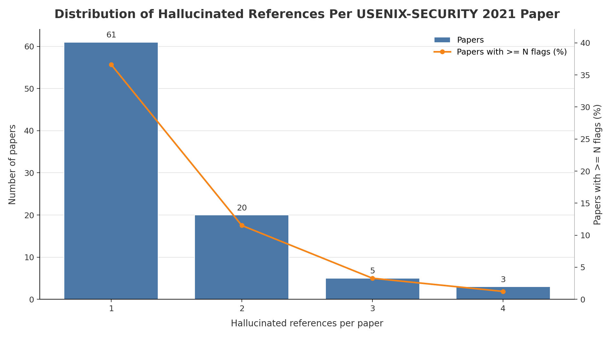

# USENIX-SECURITY 2021 Hallucinated Reference Report

Generated: 2026-05-20 02:47:48 UTC

Source: `_workspace/usenix-security2021/results/scan_report.json`

## Summary

| Metric | Count |
|---|---:|
| Hallucinated references | 128 |
| Papers with hallucinated references | 89 |
| Papers with >=3 hallucinated references | 8 |

## Distribution

| Hallucinated refs | Papers with exactly this count |
|---:|---:|
| 1 | 61 |
| 2 | 20 |
| 3 | 5 |
| 4 | 3 |

## Papers With >=3 Hallucinated References

| Rank | Hallucinated refs | Paper ID | Title | Total references | OpenReview |
|---:|---:|---|---|---:|---|
| 1 | 4 | `url_sec21-lee-hyunjoo` | Sec21-Lee-Hyunjoo | 42 | [link](https://www.usenix.org/system/files/sec21-lee-hyunjoo.pdf) |
| 2 | 4 | `url_sec21-meijer` | Sec21-Meijer | 28 | [link](https://www.usenix.org/system/files/sec21-meijer.pdf) |
| 3 | 4 | `url_sec21-ragab` | Sec21-Ragab | 45 | [link](https://www.usenix.org/system/files/sec21-ragab.pdf) |
| 4 | 3 | `url_sec21-lakshmanan` | Sec21-Lakshmanan | 30 | [link](https://www.usenix.org/system/files/sec21-lakshmanan.pdf) |
| 5 | 3 | `url_sec21-lee-yoochan` | Sec21-Lee-Yoochan | 21 | [link](https://www.usenix.org/system/files/sec21-lee-yoochan.pdf) |
| 6 | 3 | `url_sec21-lou` | Sec21-Lou | 18 | [link](https://www.usenix.org/system/files/sec21-lou.pdf) |
| 7 | 3 | `url_sec21-stute` | Sec21-Stute | 27 | [link](https://www.usenix.org/system/files/sec21-stute.pdf) |
| 8 | 3 | `url_sec21-vanhoef` | Sec21-Vanhoef | 31 | [link](https://www.usenix.org/system/files/sec21-vanhoef.pdf) |
