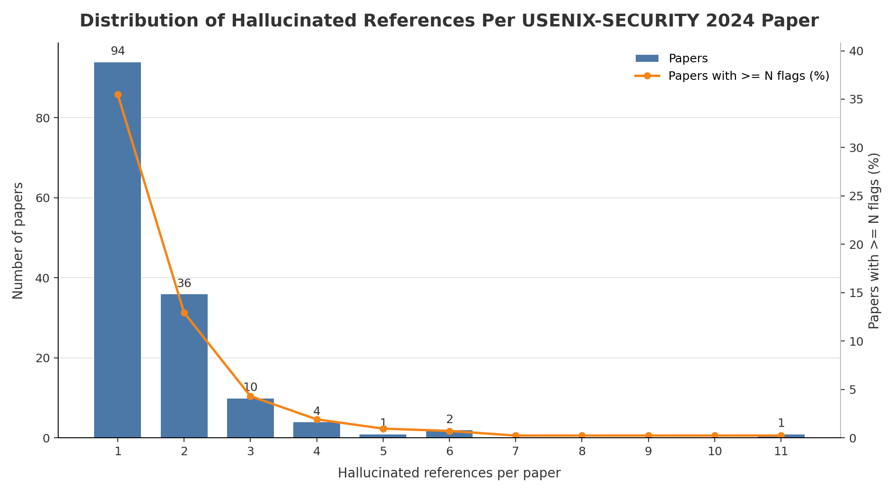

# USENIX-SECURITY 2024 Hallucinated Reference Report

Generated: 2026-05-20 02:47:48 UTC

Source: `_workspace/usenix-security2024/results/scan_report.json`

## Summary

| Metric | Count |
|---|---:|
| Hallucinated references | 240 |
| Papers with hallucinated references | 148 |
| Papers with >=3 hallucinated references | 18 |

## Distribution

| Hallucinated refs | Papers with exactly this count |
|---:|---:|
| 1 | 94 |
| 2 | 36 |
| 3 | 10 |
| 4 | 4 |
| 5 | 1 |
| 6 | 2 |
| 11 | 1 |

## Papers With >=3 Hallucinated References

| Rank | Hallucinated refs | Paper ID | Title | Total references | OpenReview |
|---:|---:|---|---|---:|---|
| 1 | 11 | `url_usenixsecurity24-thompson` | Usenixsecurity24-Thompson | 48 | [link](https://www.usenix.org/system/files/usenixsecurity24-thompson.pdf) |
| 2 | 6 | `url_usenixsecurity24-lin-zilong` | Usenixsecurity24-Lin-Zilong | 57 | [link](https://www.usenix.org/system/files/usenixsecurity24-lin-zilong.pdf) |
| 3 | 6 | `url_usenixsecurity24-mankali` | Usenixsecurity24-Mankali | 42 | [link](https://www.usenix.org/system/files/usenixsecurity24-mankali.pdf) |
| 4 | 5 | `url_usenixsecurity24-anwar` | Usenixsecurity24-Anwar | 30 | [link](https://www.usenix.org/system/files/usenixsecurity24-anwar.pdf) |
| 5 | 4 | `url_usenixsecurity24-guo-keyan` | Usenixsecurity24-Guo-Keyan | 49 | [link](https://www.usenix.org/system/files/usenixsecurity24-guo-keyan.pdf) |
| 6 | 4 | `url_usenixsecurity24-mondal` | Usenixsecurity24-Mondal | 40 | [link](https://www.usenix.org/system/files/usenixsecurity24-mondal.pdf) |
| 7 | 4 | `url_usenixsecurity24-panahi` | Usenixsecurity24-Panahi | 32 | [link](https://www.usenix.org/system/files/usenixsecurity24-panahi.pdf) |
| 8 | 4 | `url_usenixsecurity24-zhang-yunyi-dark` | Usenixsecurity24-Zhang-Yunyi-Dark | 24 | [link](https://www.usenix.org/system/files/usenixsecurity24-zhang-yunyi-dark.pdf) |
| 9 | 3 | `url_usenixsecurity24-ablove` | Usenixsecurity24-Ablove | 29 | [link](https://www.usenix.org/system/files/usenixsecurity24-ablove.pdf) |
| 10 | 3 | `url_usenixsecurity24-albayaydh` | Usenixsecurity24-Albayaydh | 47 | [link](https://www.usenix.org/system/files/usenixsecurity24-albayaydh.pdf) |
| 11 | 3 | `url_usenixsecurity24-george` | Usenixsecurity24-George | 21 | [link](https://www.usenix.org/system/files/usenixsecurity24-george.pdf) |
| 12 | 3 | `url_usenixsecurity24-han-seunghun` | Usenixsecurity24-Han-Seunghun | 21 | [link](https://www.usenix.org/system/files/usenixsecurity24-han-seunghun.pdf) |
| 13 | 3 | `url_usenixsecurity24-lassak` | Usenixsecurity24-Lassak | 53 | [link](https://www.usenix.org/system/files/usenixsecurity24-lassak.pdf) |
| 14 | 3 | `url_usenixsecurity24-lin-zhenpeng` | Usenixsecurity24-Lin-Zhenpeng | 24 | [link](https://www.usenix.org/system/files/usenixsecurity24-lin-zhenpeng.pdf) |
| 15 | 3 | `url_usenixsecurity24-schluter` | Usenixsecurity24-Schluter | 28 | [link](https://www.usenix.org/system/files/usenixsecurity24-schluter.pdf) |
| 16 | 3 | `url_usenixsecurity24-song-wei` | Usenixsecurity24-Song-Wei | 67 | [link](https://www.usenix.org/system/files/usenixsecurity24-song-wei.pdf) |
| 17 | 3 | `url_usenixsecurity24-tang` | Usenixsecurity24-Tang | 28 | [link](https://www.usenix.org/system/files/usenixsecurity24-tang.pdf) |
| 18 | 3 | `url_usenixsecurity24-zhang-jipeng` | Usenixsecurity24-Zhang-Jipeng | 35 | [link](https://www.usenix.org/system/files/usenixsecurity24-zhang-jipeng.pdf) |
