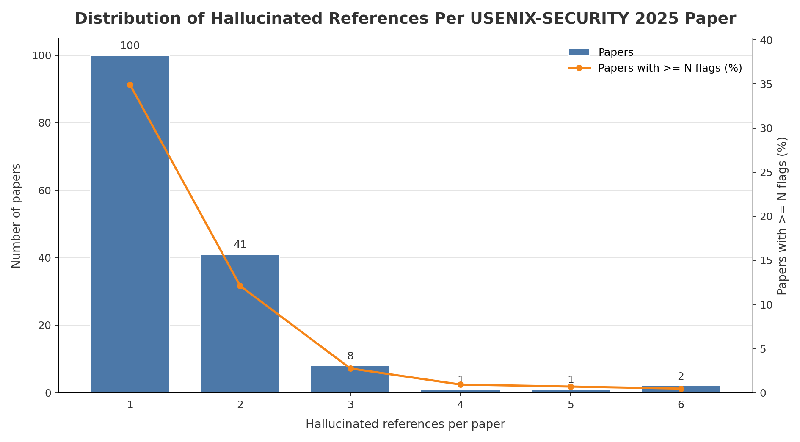

# USENIX-SECURITY 2025 Hallucinated Reference Report

Generated: 2026-05-20 02:47:49 UTC

Source: `_workspace/usenix-security2025/results/scan_report.json`

## Summary

| Metric | Count |
|---|---:|
| Hallucinated references | 227 |
| Papers with hallucinated references | 153 |
| Papers with >=3 hallucinated references | 12 |

## Distribution

| Hallucinated refs | Papers with exactly this count |
|---:|---:|
| 1 | 100 |
| 2 | 41 |
| 3 | 8 |
| 4 | 1 |
| 5 | 1 |
| 6 | 2 |

## Papers With >=3 Hallucinated References

| Rank | Hallucinated refs | Paper ID | Title | Total references | OpenReview |
|---:|---:|---|---|---:|---|
| 1 | 6 | `url_usenixsecurity25-imperati` | Usenixsecurity25-Imperati | 48 | [link](https://www.usenix.org/system/files/usenixsecurity25-imperati.pdf) |
| 2 | 6 | `url_usenixsecurity25-mungara` | Usenixsecurity25-Mungara | 57 | [link](https://www.usenix.org/system/files/usenixsecurity25-mungara.pdf) |
| 3 | 5 | `url_usenixsecurity25-afek` | Usenixsecurity25-Afek | 47 | [link](https://www.usenix.org/system/files/usenixsecurity25-afek.pdf) |
| 4 | 4 | `url_usenixsecurity25-ma-fuchen` | Usenixsecurity25-Ma-Fuchen | 35 | [link](https://www.usenix.org/system/files/usenixsecurity25-ma-fuchen.pdf) |
| 5 | 3 | `url_usenixsecurity25-agarwal-sharad` | Usenixsecurity25-Agarwal-Sharad | 50 | [link](https://www.usenix.org/system/files/usenixsecurity25-agarwal-sharad.pdf) |
| 6 | 3 | `url_usenixsecurity25-he-yu` | Usenixsecurity25-He-Yu | 45 | [link](https://www.usenix.org/system/files/usenixsecurity25-he-yu.pdf) |
| 7 | 3 | `url_usenixsecurity25-li-ao` | Usenixsecurity25-Li-Ao | 30 | [link](https://www.usenix.org/system/files/usenixsecurity25-li-ao.pdf) |
| 8 | 3 | `url_usenixsecurity25-li-weitong` | Usenixsecurity25-Li-Weitong | 28 | [link](https://www.usenix.org/system/files/usenixsecurity25-li-weitong.pdf) |
| 9 | 3 | `url_usenixsecurity25-liu-zhengyu` | Usenixsecurity25-Liu-Zhengyu | 16 | [link](https://www.usenix.org/system/files/usenixsecurity25-liu-zhengyu.pdf) |
| 10 | 3 | `url_usenixsecurity25-singh` | Usenixsecurity25-Singh | 35 | [link](https://www.usenix.org/system/files/usenixsecurity25-singh.pdf) |
| 11 | 3 | `url_usenixsecurity25-tang` | Usenixsecurity25-Tang | 29 | [link](https://www.usenix.org/system/files/usenixsecurity25-tang.pdf) |
| 12 | 3 | `url_usenixsecurity25-ye-attacks` | Usenixsecurity25-Ye-Attacks | 40 | [link](https://www.usenix.org/system/files/usenixsecurity25-ye-attacks.pdf) |
